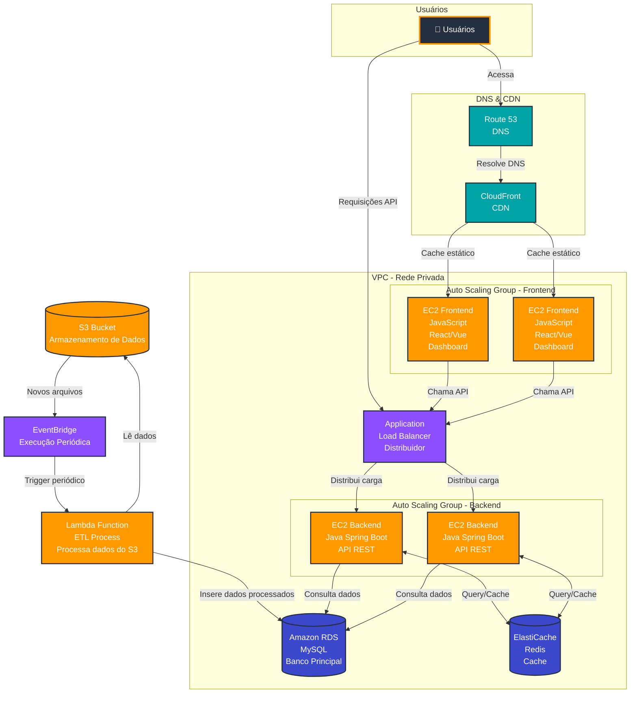

## 1. Visão Geral

Esta camada da arquitetura é responsável pela **interface do usuário e processamento das requisições analíticas**. O sistema deve suportar múltiplos usuários acessando dashboards simultaneamente, executando consultas e aplicando filtros sobre grandes volumes de dados.

A solução foi projetada com foco em alta disponibilidade, escalabilidade horizontal e baixa latência. Para isso, adota uma abordagem distribuída, com separação clara entre frontend, backend e camada de dados, além do uso intensivo de cache e serviços gerenciados.

---
## 2. Diagrama da Arquitetura da Aplicação

---
## 3. Componentes

### 3.1. Route 53 + CloudFront

**Função:** Distribuir e otimizar o acesso ao frontend.

O Route 53 realiza a resolução de DNS, enquanto o CloudFront atua como CDN, entregando conteúdo estático com baixa latência a partir de edge locations.

Essa combinação reduz significativamente o tempo de carregamento da aplicação e diminui a carga nos servidores de origem.

---

### 3.2. Application Load Balancer (ALB)

**Função:** Distribuir requisições entre instâncias backend.

O ALB garante alta disponibilidade ao rotear tráfego apenas para instâncias saudáveis, além de permitir escalabilidade automática conforme a carga. Também centraliza a terminação SSL e suporta roteamento baseado em regras.

---
### 3.3. Backend (EC2 - API REST)

**Função:** Processar regras de negócio e expor endpoints para o frontend.

A aplicação backend é stateless, permitindo escalabilidade horizontal via Auto Scaling. As instâncias processam requisições em paralelo e acessam o banco de dados e o cache conforme necessário.

A escolha por EC2 oferece maior controle de runtime e configuração, sendo adequada para cargas previsíveis e customização de ambiente.

---
### 3.4. Frontend (SPA)

**Função:** Interface do dashboard para o usuário.

O frontend é uma aplicação SPA (React ou Vue), responsável pela renderização dos dashboards e interação com a API.

Embora esteja representado em EC2, essa camada pode evoluir para um modelo serverless utilizando S3 + CloudFront, reduzindo custos e complexidade operacional.

---
### 3.5. Banco de Dados (RDS)

**Função:** Armazenar dados estruturados para consulta.

O RDS fornece uma camada relacional gerenciada, com suporte a alta disponibilidade (Multi-AZ), backups automáticos e escalabilidade vertical.

A maior parte das operações são leituras analíticas, podendo ser distribuídas via read replicas em cenários de maior carga.

---

### 3.6. Cache (Redis - ElastiCache)

**Função:** Reduzir latência e carga no banco de dados.

O Redis é utilizado como camada de cache para armazenar resultados de queries frequentes e agregações. Isso permite reduzir drasticamente o tempo de resposta e evitar consultas repetidas ao banco.

A estratégia principal adotada é **cache-aside**, onde a aplicação consulta primeiro o cache e, em caso de ausência, busca no banco e armazena o resultado.

---

### 3.7. Processamento ETL (Lambda + EventBridge)

**Função:** Atualizar periodicamente os dados analíticos.

O EventBridge agenda execuções periódicas de uma função Lambda, responsável por ler dados do Data Lake (S3), aplicar transformações e atualizar o banco relacional.

Esse processamento é feito em background, desacoplado do fluxo de requisições do usuário.

---

## 4. Fluxo de Requisições

### 4.1 Acesso ao Frontend

O usuário acessa a aplicação via domínio configurado no Route 53. O CloudFront entrega os arquivos estáticos (HTML, CSS, JS), utilizando cache sempre que possível para reduzir latência.

Em caso de cache miss, o conteúdo é buscado no origin e armazenado para requisições futuras.

### 4.2 Requisições à API

As requisições do frontend são encaminhadas ao Load Balancer, que distribui o tráfego entre as instâncias backend.

O backend segue o fluxo:

- Verifica se a resposta está no cache (Redis)
- Em caso de cache hit, retorna imediatamente
- Em caso de cache miss, consulta o banco (RDS)
- Armazena o resultado no cache
- Retorna a resposta ao cliente

### 4.3 Atualização de Dados (ETL)

O processamento de dados ocorre de forma assíncrona:

- EventBridge agenda execuções periódicas
- Lambda processa dados do S3
- Dados são transformados e inseridos no RDS

---

## 5. Estratégias de Escalabilidade

A arquitetura suporta alta volumetria por meio de:

- Escalabilidade horizontal com múltiplas instâncias  
- Cache em múltiplas camadas (CDN + Redis)  
- Balanceamento de carga via ALB  
- Backend stateless para facilitar scaling  
- Uso de serviços gerenciados  

---

## 6. Estimativa de Capacidade

**Cenário:** 1.000 usuários simultâneos

| Camada | Capacidade |
|--------|-----------|
| Backend (4 instâncias) | ~1.500 req/s |
| Frontend | ~2.000 req/s |
| Cache (Redis) | >100.000 ops/s |
| RDS | Dependente da carga de leitura |

---

## 7. Considerações

A arquitetura prioriza simplicidade operacional e escalabilidade. Em evoluções futuras, é possível migrar partes da aplicação para modelos serverless, reduzindo custo e complexidade, especialmente na camada de frontend.

O uso de cache e a separação entre processamento e consumo garantem baixa latência mesmo sob alta carga.