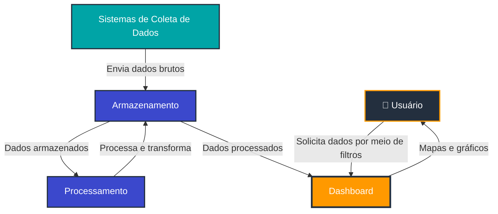
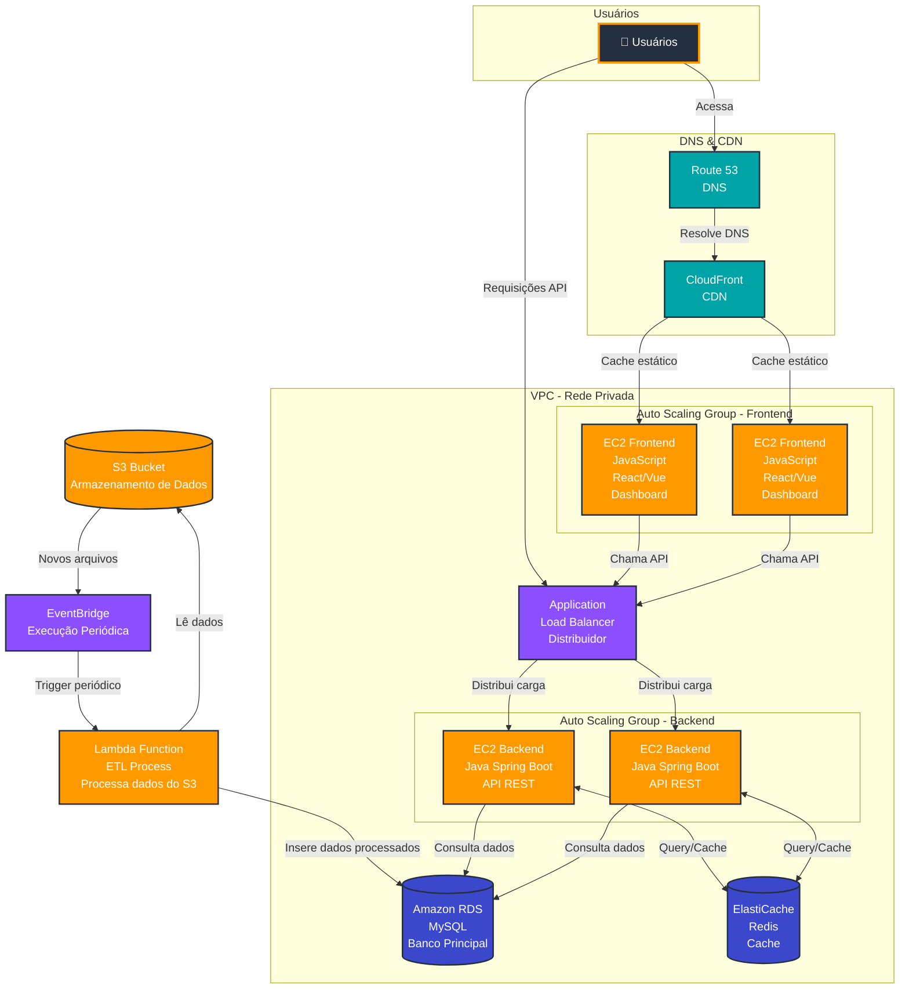

import useBaseUrl from '@docusaurus/useBaseUrl';

# Arquitetura da Aplicação - Primeira Versão

:::info
Esta é a **primeira versão** da arquitetura da aplicação e está **sujeita a mudanças** conforme o projeto evolui e novos requisitos são identificados durante o desenvolvimento.
:::

## Visão Geral do Sistema

O projeto consiste no desenvolvimento de uma aplicação web para análise de dados de mídia exterior (OOH - Out of Home) para a Eletromidia. No contexto real, a empresa recebe um arquivo CSV a cada 3 meses contendo dados consolidados. No entanto, para este projeto acadêmico, **estamos simulando um cenário de API em tempo real** que envia requisições HTTP com lotes de dados várias vezes por segundo/minuto, permitindo o estudo e desenvolvimento de uma **aplicação intensiva de dados com alta volumetria**.

A arquitetura foi dividida em **dois momentos principais**:

1. **Ingestão de Dados e Armazenamento** (Data Lake e Data Warehouse)
2. **Utilização da Aplicação** (Frontend/Backend - Dashboard)

Esta divisão permite uma separação clara de responsabilidades, escalabilidade independente de cada componente e otimização específica para diferentes tipos de carga de trabalho.

---

## 1. Arquitetura de Ingestão de Dados

### 1.1 Visão Geral

A arquitetura de ingestão foi projetada para **receber e processar alto volume de dados** provenientes de uma API simulada da Claro. Neste cenário, estamos simulando que a API estará enviando requisições HTTP com lotes de dados várias vezes por segundo/minuto. O objetivo é receber, processar e armazenar esses dados de maneira eficiente em um Data Lake, utilizando o formato Apache Iceberg.

### 1.2 Diagrama da Arquitetura de Ingestão

```mermaid
graph TB
    %% Definição de estilos
    classDef awsOrange fill:#FF9900,stroke:#232F3E,stroke-width:3px,color:#fff,font-weight:bold
    classDef awsGreen fill:#3F8624,stroke:#232F3E,stroke-width:3px,color:#fff,font-weight:bold
    classDef awsBlue fill:#527FFF,stroke:#232F3E,stroke-width:3px,color:#fff,font-weight:bold
    classDef external fill:#EC1C24,stroke:#fff,stroke-width:3px,color:#fff,font-weight:bold
    classDef iceberg fill:#00C7D4,stroke:#232F3E,stroke-width:3px,color:#fff,font-weight:bold
    classDef worker fill:#9D5025,stroke:#232F3E,stroke-width:3px,color:#fff,font-weight:bold
    
    %% API Externa
    CLARO["🔴 API Claro<br/><br/>Envia batch de dados<br/>periodicamente"]:::external
    
    %% VPC Container
    subgraph VPC["☁️ VPC"]
        direction TB
        
        %% Camada de Entrada
        API["📡 AWS API Gateway<br/><br/>Recebe requests e<br/>encaminha para SQS"]:::awsOrange
        
        %% Camada de Processamento
        SQS["📬 Amazon SQS<br/><br/>Fila de mensagens"]:::awsOrange
        
        LAMBDA["⚡ AWS Lambda<br/><br/>Consome dados da fila,<br/>processa em lotes e<br/>armazena no datalake"]:::awsOrange
        
        %% Camada de Armazenamento
        subgraph S3_LAYER["📦 Amazon S3"]
            direction TB
            S3["☁️ S3 Bucket"]:::awsGreen
            
            subgraph DATALAKE["🗄️ Datalake - Camada RAW"]
                direction LR
                ICEBERG["❄️ Apache Iceberg<br/><br/>Dados não processados"]:::iceberg
                TABLE["📊 Tabela<br/>┌──────────┬────────┐<br/>│ PK, FK1  │ Row 1  │<br/>│ PK, FK2  │ Row 2  │<br/>│          │ Row 3  │<br/>│          │ Row 4  │<br/>└──────────┴────────┘"]:::iceberg
            end
        end
        
        %% Worker
        WORKER["⚙️ Worker ETL<br/><br/>Processa dados do lake<br/>periodicamente e faz<br/>ingestão para banco<br/>relacional/DW"]:::worker
    end
    
    %% Banco de Destino
    DB[("💾 Banco de Dados<br/>Relacional<br/><br/>Dados processados<br/>e estruturados")]:::awsBlue
    
    %% Fluxos
    CLARO -->|"HTTP POST<br/>Batch de dados"| API
    API -->|"Enfileira<br/>mensagens"| SQS
    SQS -->|"Trigger<br/>assíncrono"| LAMBDA
    LAMBDA -->|"Grava dados<br/>brutos (RAW)"| S3
    S3 -.-> DATALAKE
    DATALAKE -.->|"Leitura<br/>periódica"| WORKER
    WORKER -->|"ETL e<br/>ingestão"| DB
    
    %% Estilo da VPC
    style VPC fill:#E8F4F8,stroke:#00A1C9,stroke-width:4px,stroke-dasharray: 5 5
    style S3_LAYER fill:#F0F8F0,stroke:#3F8624,stroke-width:3px
    style DATALAKE fill:#E6F7FF,stroke:#00C7D4,stroke-width:3px
```

  
<strong>Figura 1 - Arquitetura de ingestão de dados</strong>

  
  
Fonte: Elaborado pelo grupo Café da Sophia (2026)

### 1.3 Componentes e Justificativas

#### 1.3.1 AWS API Gateway

**Função:** Porta de entrada para todas as requisições HTTP vindas da API simulada da Claro.

**Justificativa:**
- **Escalabilidade:** Suporta até **10.000 requisições por segundo** por conta, com possibilidade de aumento via solicitação à AWS
- **Custo-benefício:** US$ 3,50 por milhão de requisições na região us-east-1
- **Gerenciamento:** Oferece throttling, rate limiting e validação de requisições automaticamente
- **Segurança:** Integração nativa com IAM, possibilidade de uso de API Keys e validação de payload
- **Monitoramento:** Integração com CloudWatch para métricas de latência, erros e throughput

**Capacidade:**
- Latência típica: 20-50ms
- Payload máximo: 10MB por requisição
- Timeout máximo: 29 segundos

#### 1.3.2 Amazon SQS (Simple Queue Service)

**Função:** Fila de mensagens que atua como buffer entre o API Gateway e o processamento Lambda.

**Justificativa:**
- **Desacoplamento:** Permite que a ingestão e o processamento operem em velocidades diferentes
- **Alta disponibilidade:** SLA de 99.9%, com replicação automática em múltiplas zonas de disponibilidade
- **Escalabilidade ilimitada:** Suporta **praticamente ilimitadas** mensagens na fila
- **Throughput:** Até **3.000 mensagens por segundo** (batches) com Standard Queue
- **Custo:** US$ 0,40 por milhão de requisições (primeiro 1 milhão gratuito por mês)
- **Resiliência:** Garante entrega de mensagens (at-least-once delivery)
- **Visibilidade:** Timeout de visibilidade configurável para prevenir processamento duplicado

**Capacidade:**
- Tamanho máximo de mensagem: 256KB
- Retenção: 1 minuto a 14 dias (padrão: 4 dias)
- Long polling: Reduz custos e latência

#### 1.3.3 AWS Lambda

**Função:** Função serverless que consome mensagens da fila SQS, processa os dados em lotes e armazena no Data Lake (S3).

**Justificativa:**
- **Escalabilidade automática:** Escala automaticamente de 0 a **1.000 instâncias concorrentes** (padrão, pode ser aumentado)
- **Processamento em lotes:** Pode processar até **10 mensagens do SQS por invocação**, otimizando custo e performance
- **Custo:** US$ 0,20 por 1 milhão de requisições + US$ 0,0000166667 por GB-segundo de computação
- **Camada gratuita:** 1 milhão de requisições gratuitas por mês + 400.000 GB-segundo
- **Sem gerenciamento de servidor:** Não há necessidade de provisionar ou gerenciar infraestrutura
- **Timeout configurável:** Até 15 minutos por execução
- **Memória ajustável:** 128MB a 10GB, permitindo otimização de performance

**Capacidade:**
- Throughput: **Milhares de requisições por segundo** com concorrência adequada
- Payload de resposta: 6MB (síncrono), 256KB (assíncrono)
- Processamento de lote do SQS: 1-10 mensagens por invocação

#### 1.3.4 Amazon S3 + Apache Iceberg (Data Lake - Camada RAW)

**Função:** Armazenamento de dados brutos (RAW) no formato Apache Iceberg, criando um Data Lake escalável e de baixo custo.

**Justificativa do S3:**
- **Durabilidade:** 99.999999999% (11 noves) de durabilidade
- **Disponibilidade:** 99.99% de disponibilidade
- **Escalabilidade ilimitada:** Pode armazenar quantidades ilimitadas de dados
- **Custo:** US$ 0,023 por GB/mês (S3 Standard) na região us-east-1
- **Performance:** Suporta **3.500 requisições PUT/COPY/POST/DELETE** e **5.500 requisições GET/HEAD por segundo por prefixo**
- **Integração:** Nativa com todo o ecossistema AWS

**Justificativa do Apache Iceberg:**
- **Formato de tabela moderno:** Suporta transações ACID, schema evolution e time travel
- **Performance:** Permite leituras eficientes através de partition pruning e metadata caching
- **Evolução de schema:** Adicionar, remover ou renomear colunas sem reescrever dados
- **Versionamento:** Mantém histórico de alterações para auditoria e rollback
- **Compatibilidade:** Funciona com Spark, Flink, Trino, Presto e outras engines de processamento
- **Otimização de storage:** Compactação automática e merge de arquivos pequenos

**Capacidade:**
- Throughput de transferência: Até **100 Gbps** por bucket
- Operações de listagem: 5.500 por segundo por prefixo
- Compactação de dados: Reduz custos de storage e melhora performance de queries

#### 1.3.5 Worker ETL

**Função:** Processo periódico que lê dados da camada RAW do Data Lake, realiza transformações (ETL) e carrega os dados processados no Data Warehouse/Banco Relacional.

**Justificativa:**
- **Separação de responsabilidades:** Desacopla a ingestão do processamento analítico
- **Processamento em batch:** Permite transformações complexas em grandes volumes de dados
- **Agendamento flexível:** Pode ser executado em horários de menor carga
- **Qualidade de dados:** Aplica regras de validação, limpeza e enriquecimento
- **Performance otimizada:** Processa dados em lotes para maximizar throughput

**Opções de implementação:**
- AWS Glue: Serviço serverless de ETL (US$ 0,44 por DPU-hora)
- AWS Step Functions + Lambda: Orquestração de múltiplas funções
- ECS/Fargate: Para processamentos mais complexos
- Airflow em EC2: Para workflows complexos e customizáveis

#### 1.3.6 Banco de Dados Relacional (Data Warehouse)

**Função:** Armazenamento de dados processados e estruturados, otimizados para consultas analíticas e alimentação do dashboard.

**Justificativa:**
- **Dados estruturados:** Schema definido e otimizado para queries analíticas
- **Performance de consulta:** Índices e otimizações para leituras rápidas
- **Integridade de dados:** Constraints e relacionamentos garantem consistência
- **Integração com BI:** Fácil conexão com ferramentas de visualização

**Opções (a serem definidas):**
- Amazon RDS MySQL/PostgreSQL
- Amazon Redshift (para workloads analíticos pesados)
- Amazon Aurora (alta performance e disponibilidade)

### 1.4 Fluxo de Dados Detalhado

1. **API Claro → API Gateway (HTTP POST)**
   - A API externa envia lotes de dados via HTTP POST
   - API Gateway valida a requisição e retorna 200 OK imediatamente
   - Latência típica: 20-50ms

2. **API Gateway → SQS (Enfileiramento)**
   - API Gateway enfileira a mensagem no SQS
   - Operação assíncrona, não bloqueia a resposta ao cliente
   - Mensagem fica retida na fila até ser processada

3. **SQS → Lambda (Trigger assíncrono)**
   - Lambda é acionada automaticamente quando há mensagens na fila
   - Processa até 10 mensagens por invocação (batch processing)
   - Se houver erro, mensagem retorna para a fila (com retry automático)

4. **Lambda → S3 (Gravação de dados brutos)**
   - Lambda valida e transforma os dados conforme necessário
   - Grava os dados no formato Apache Iceberg no S3
   - Particiona os dados por data/hora para otimizar consultas futuras

5. **Worker ETL (Leitura periódica)**
   - Executa em intervalos regulares (ex: a cada hora)
   - Lê novos dados da camada RAW
   - Aplica transformações, agregações e limpeza

6. **Worker → Data Warehouse (ETL e ingestão)**
   - Carrega dados processados no banco relacional
   - Atualiza tabelas dimensionais e fatos
   - Disponibiliza dados para consulta pelo dashboard

### 1.5 Estimativas de Capacidade e Custo

:::info Versão 1.0
Os valores abaixo são estimativas baseadas em cenários simulados e estão sujeitos a ajustes conforme a volumetria real do projeto.
:::

**Cenário de exemplo: 1.000 requisições por segundo**

| Serviço | Capacidade | Custo Mensal Estimado |
|---------|-----------|----------------------|
| API Gateway | 1.000 req/s = 2,6 bilhões/mês | US$ 9.100 |
| SQS | 1.000 msg/s = 2,6 bilhões/mês | US$ 1.040 |
| Lambda (500ms, 1GB) | 2,6 bilhões invocações | US$ 520 + US$ 3.800 = US$ 4.320 |
| S3 (100GB novos/mês) | 100GB storage + transfer | US$ 2,30 + transfer |
| **Total** | | **~US$ 16.500/mês** |

**Otimizações possíveis:**
- Usar batching no API Gateway para reduzir número de invocações Lambda
- Comprimir dados antes de enviar ao S3
- Usar S3 Intelligent-Tiering para dados antigos
- Ajustar memória do Lambda baseado em profiling

---

## 2. Arquitetura da Aplicação (Dashboard)

---

## 2. Arquitetura da Aplicação (Dashboard)

### 2.1 Visão Geral

Esta segunda parte da arquitetura é responsável pela **interface de usuário e processamento de requisições** dos analistas da Eletromidia. O sistema precisa suportar **altos volumes de requisições simultâneas**, pois múltiplos usuários estarão acessando dashboards, gerando relatórios e aplicando filtros complexos sobre grandes conjuntos de dados.

A arquitetura foi projetada com foco em:
- **Alta disponibilidade:** Garantir que o sistema esteja sempre acessível
- **Escalabilidade horizontal:** Suportar crescimento de usuários e carga
- **Performance:** Responder rapidamente a consultas complexas
- **Resiliência:** Continuar operando mesmo com falhas parciais

### 2.2 Diagrama da Arquitetura da Aplicação

### 2.3 Componentes e Justificativas

#### 2.3.1 Amazon Route 53 (DNS)

**Função:** Serviço de DNS que resolve o nome de domínio da aplicação para os endereços IP corretos.

**Justificativa:**
- **Alta disponibilidade:** SLA de 100% de disponibilidade
- **Baixa latência:** Rede global de DNS distribuída
- **Health checks:** Monitora saúde dos endpoints e roteia tráfego automaticamente
- **Failover:** Redireciona tráfego em caso de falhas
- **Custo:** US$ 0,50 por hosted zone/mês + US$ 0,40 por milhão de queries
- **Escalabilidade:** Suporta bilhões de queries por dia

**Capacidade:**
- Latência de consulta: Geralmente < 10ms
- Queries ilimitadas
- Integração com CloudWatch para monitoramento

#### 2.3.2 Amazon CloudFront (CDN)

**Função:** Content Delivery Network que distribui conteúdo estático (HTML, CSS, JS, imagens) globalmente.

**Justificativa:**
- **Performance:** Reduz latência servindo conteúdo de edge locations próximas aos usuários
- **Redução de carga:** Diminui tráfego nos servidores de origem (EC2 Frontend)
- **Cache inteligente:** Armazena conteúdo estático em 450+ pontos de presença globalmente
- **Segurança:** Proteção contra DDoS, integração com AWS WAF e Shield
- **Compressão:** Compressão automática de arquivos (Gzip/Brotli)
- **HTTPS:** Certificados SSL/TLS gratuitos via AWS Certificate Manager
- **Custo:** US$ 0,085 por GB de transferência (primeiros 10TB) na América do Norte

**Capacidade:**
- Throughput: Automaticamente escalável
- Cache TTL: Configurável por tipo de conteúdo
- Invalidação de cache: Possível via API

**Impacto:**
- Redução de latência: 50-90% para usuários distantes
- Redução de carga no origin: 70-90% das requisições atendidas pelo cache

#### 2.3.3 Application Load Balancer (ALB)

**Função:** Distribui requisições HTTP/HTTPS entre múltiplas instâncias EC2 backend e frontend.

**Justificativa:**
- **Distribuição de carga:** Balanceia tráfego entre instâncias saudáveis
- **Health checks:** Remove automaticamente instâncias não saudáveis do pool
- **Escalabilidade:** Escala automaticamente para suportar tráfego crescente
- **Roteamento avançado:** Suporta roteamento baseado em path, host, headers
- **Sticky sessions:** Mantém sessão do usuário na mesma instância quando necessário
- **SSL/TLS offloading:** Termina conexões SSL no load balancer
- **Custo:** US$ 0,0225 por hora + US$ 0,008 por LCU-hora

**Capacidade:**
- **Requisições por segundo:** Até **100.000 requisições por segundo** por ALB
- Conexões simultâneas: Centenas de milhares
- Targets: Até 1.000 targets por target group
- Latência adicional: Tipicamente 1-5ms

**Monitoramento:**
- Integração com CloudWatch para métricas de latência, 4xx, 5xx
- Access logs detalhados para análise

#### 2.3.4 Auto Scaling Groups (Backend e Frontend)

**Função:** Gerencia automaticamente o número de instâncias EC2 baseado em métricas de carga.

**Justificativa:**
- **Elasticidade:** Adiciona instâncias durante picos de demanda
- **Custo-eficiência:** Remove instâncias quando carga diminui
- **Alta disponibilidade:** Distribui instâncias em múltiplas AZs
- **Self-healing:** Substitui automaticamente instâncias não saudáveis
- **Previsibilidade:** Pode escalar baseado em schedule ou métricas customizadas

**Configuração típica:**
- **Mínimo:** 2 instâncias (alta disponibilidade)
- **Desejado:** 2-4 instâncias (operação normal)
- **Máximo:** 10+ instâncias (picos de carga)

**Métricas de scaling:**
- CPU Utilization: Escala quando > 70%
- Request count per target: Quando > 1000 req/min por instância
- Latência: Quando > 500ms
- Métricas customizadas: Queries ao banco, tamanho de fila

#### 2.3.5 EC2 Backend (Java Spring Boot - API REST)

**Função:** Servidores de aplicação que processam a lógica de negócio e servem a API REST.

**Justificativa:**
- **Spring Boot:** Framework maduro e robusto para APIs REST
- **Performance:** Java oferece excelente performance para workloads de servidor
- **Escalabilidade horizontal:** Múltiplas instâncias processam requisições em paralelo
- **Stateless:** Instâncias não mantêm estado, facilitando scaling
- **Ecossistema:** Ampla variedade de bibliotecas e ferramentas

**Tipo de instância sugerido:**
- **t3.medium** (2 vCPU, 4GB RAM): Para cargas moderadas - US$ 0,0416/hora
- **c6i.large** (2 vCPU, 4GB RAM): Para cargas CPU-intensive - US$ 0,085/hora
- **m6i.large** (2 vCPU, 8GB RAM): Para cargas balanceadas - US$ 0,096/hora

**Capacidade estimada por instância:**
- Requisições por segundo: 100-500 rps (depende da complexidade das queries)
- Conexões simultâneas: 200-500
- Throughput: 10-50 MB/s

**Otimizações:**
- Connection pooling para banco de dados
- Cache local (Caffeine/Guava) para dados frequentes
- Async processing para operações pesadas
- Tuning de JVM (heap size, GC)

#### 2.3.6 EC2 Frontend (React/Vue - Dashboard)

**Função:** Servidores que hospedam a aplicação Single Page Application (SPA) do dashboard.

**Justificativa:**
- **SPA moderna:** React ou Vue oferecem experiência de usuário fluida
- **Componentização:** Reutilização de componentes de UI
- **State management:** Redux/Vuex para gerenciamento de estado complexo
- **Visualização de dados:** Bibliotecas como D3.js, Chart.js para gráficos
- **Maps:** Integração com Mapbox/Google Maps para visualização geográfica

**Tipo de instância sugerido:**
- **t3.small** (2 vCPU, 2GB RAM): US$ 0,0208/hora
- Serve principalmente arquivos estáticos pré-compilados

**Nota:** Alternativamente, o frontend poderia ser hospedado apenas no S3 + CloudFront (arquitetura serverless para frontend), reduzindo custos e complexidade. Esta é uma **otimização a ser considerada** em versões futuras.

**Capacidade:**
- Requisições por segundo: 500-1000 rps (arquivos estáticos)
- Throughput: 50-100 MB/s

#### 2.3.7 Amazon RDS MySQL

**Função:** Banco de dados relacional principal que armazena dados processados do Data Warehouse.

**Justificativa:**
- **Managed service:** AWS gerencia backups, patches, failover
- **Alta disponibilidade:** Multi-AZ deployment com failover automático
- **Performance:** Read replicas para distribuir carga de leitura
- **Escalabilidade vertical:** Pode aumentar capacidade sem downtime
- **Backups automáticos:** Point-in-time recovery até 35 dias
- **Segurança:** Encryption at rest e in transit
- **Custo:** US$ 0,017/hora para db.t3.micro (1 vCPU, 1GB RAM)

**Tipo de instância sugerido:**
- **db.m6i.large** (2 vCPU, 8GB RAM): US$ 0,192/hora
- **db.r6i.xlarge** (4 vCPU, 32GB RAM): US$ 0,504/hora (memory-optimized)

**Capacidade:**
- IOPS: 3.000-16.000 IOPS (dependendo do storage type)
- Storage: Até 64TB
- Conexões: 150-5000 (depende da classe de instância)
- Throughput: 125-2000 MB/s

**Read Replicas:**
- Até 5 read replicas por instância master
- Distribuem carga de leitura (90% das queries são leituras)
- Podem ser promovidas a master em caso de falha

**Otimizações:**
- Índices otimizados para queries frequentes
- Particionamento de tabelas grandes
- Query cache e buffer pool tuning
- Connection pooling no application layer

#### 2.3.8 Amazon ElastiCache (Redis)

**Função:** Cache distribuído em memória para reduzir latência e carga no banco de dados.

**Justificativa:**
- **Performance extrema:** Latência de < 1ms para operações de cache
- **Redução de carga no RDS:** 80-95% das queries podem ser atendidas pelo cache
- **Throughput:** Milhões de operações por segundo
- **Estruturas de dados ricas:** Suporta strings, hashes, lists, sets, sorted sets
- **TTL automático:** Expiração automática de chaves antigas
- **Alta disponibilidade:** Multi-AZ com failover automático
- **Custo:** US$ 0,034/hora para cache.t3.micro (2 vCPU, 0.5GB)

**Tipo de instância sugerido:**
- **cache.m6g.large** (2 vCPU, 6.38GB): US$ 0,136/hora
- **cache.r6g.xlarge** (4 vCPU, 26.32GB): US$ 0,302/hora

**Capacidade:**
- **Operações por segundo:** Até **1 milhão de ops/segundo** por nó
- Network throughput: Até 10 Gbps
- Conexões simultâneas: 65.000

**Estratégias de cache:**
- **Cache-aside:** Aplicação verifica cache primeiro, depois banco
- **Write-through:** Escreve no cache e banco simultaneamente
- **TTL:** 5-60 minutos dependendo da volatilidade dos dados
- **Eviction policy:** LRU (Least Recently Used)

**Dados cacheados:**
- Resultados de queries complexas
- Dados de sessão de usuários
- Agregações e métricas pré-calculadas
- Configurações da aplicação

**Impacto:**
- Redução de latência: 100-1000x (de 100ms para < 1ms)
- Redução de carga no RDS: 80-95%
- Aumento de throughput: 10-100x

#### 2.3.9 AWS Lambda (Worker ETL)

**Função:** Função que processa dados periodicamente do S3 (Data Lake) e insere no RDS.

**Justificativa:**
- **Serverless:** Não há infraestrutura para gerenciar
- **Event-driven:** Acionada por EventBridge em horários programados
- **Escalável:** Processa lotes grandes de dados automaticamente
- **Custo-eficiente:** Paga apenas pelo tempo de execução

**Capacidade:**
- Timeout: Até 15 minutos por execução
- Memória: 128MB a 10GB
- Pode processar milhões de registros por execução com batch processing

#### 2.3.10 AWS EventBridge

**Função:** Serviço de barramento de eventos que agenda execuções periódicas do Lambda.

**Justificativa:**
- **Scheduling:** Cron expressions para execução periódica
- **Flexibilidade:** Pode ser acionado por diversos eventos AWS
- **Confiabilidade:** Entrega garantida de eventos
- **Custo:** US$ 1,00 por milhão de eventos

**Configuração típica:**
- Execução a cada hora: `cron(0 * * * ? *)`
- Execução a cada 15 minutos: `cron(0/15 * * * ? *)`

### 2.4 Fluxo de Requisições

#### 2.4.1 Fluxo do Usuário (Frontend)

1. **Usuário → Route 53**
   - Usuário digita URL ou acessa bookmark
   - Route 53 resolve DNS para CloudFront

2. **Route 53 → CloudFront**
   - CloudFront recebe requisição
   - Verifica se conteúdo está em cache

3. **CloudFront → EC2 Frontend (se necessário)**
   - Se não estiver em cache, busca do origin (EC2)
   - Armazena em cache para próximas requisições
   - Retorna para o usuário

4. **Tempo de resposta típico:**
   - Cache hit: 10-50ms
   - Cache miss: 100-300ms

#### 2.4.2 Fluxo de Requisições API

1. **Usuário → ALB**
   - Frontend SPA faz requisição Ajax/Fetch para API
   - ALB recebe requisição

2. **ALB → EC2 Backend**
   - ALB escolhe instância saudável baseado em algoritmo (round-robin)
   - Encaminha requisição

3. **EC2 Backend → ElastiCache**
   - Backend verifica se resposta está em cache
   - Se sim, retorna imediatamente (< 5ms)

4. **EC2 Backend → RDS (cache miss)**
   - Se não estiver em cache, consulta banco de dados
   - Executa query SQL
   - Armazena resultado no cache
   - Retorna resposta

5. **Tempos de resposta:**
   - Cache hit: 5-20ms
   - Cache miss (query simples): 50-200ms
   - Cache miss (query complexa): 200-1000ms

#### 2.4.3 Fluxo ETL (Background)

1. **EventBridge → Lambda**
   - EventBridge dispara Lambda no horário agendado

2. **Lambda → S3**
   - Lambda lê novos dados do Data Lake
   - Aplica transformações

3. **Lambda → RDS**
   - Insere/atualiza dados no banco
   - Usa batch inserts para performance

4. **Duração típica:**
   - 1-10 minutos dependendo do volume de dados

### 2.5 Justificativa para Suportar Alto Volume de Requisições

A arquitetura foi especificamente desenhada para **alta volumetria** através de:

1. **Escalabilidade Horizontal**
   - Auto Scaling Groups podem adicionar instâncias automaticamente
   - Sem limite teórico de capacidade

2. **Cache em Múltiplas Camadas**
   - CloudFront: Cache de conteúdo estático
   - ElastiCache: Cache de dados dinâmicos
   - Reduz 80-95% da carga no banco de dados

3. **Load Balancing**
   - ALB distribui carga entre múltiplas instâncias
   - Suporta até 100.000 req/s

4. **Stateless Architecture**
   - Instâncias backend não mantêm estado
   - Facilita scaling horizontal

5. **Managed Services**
   - RDS, ElastiCache, ALB escalam automaticamente
   - AWS garante SLAs de disponibilidade

6. **Separação de Responsabilidades**
   - Frontend e backend em instâncias separadas
   - Podem escalar independentemente

### 2.6 Estimativa de Capacidade Total

**Cenário: 1.000 usuários simultâneos, 10 req/s por usuário**

| Camada | Capacidade | Custo Mensal |
|--------|-----------|-------------|
| Route 53 | Ilimitado | US$ 0,50 |
| CloudFront | 10TB transferência | US$ 850 |
| ALB | 10.000 req/s | US$ 50 |
| EC2 Backend (4x m6i.large) | 1.600 req/s | US$ 280 |
| EC2 Frontend (2x t3.small) | 2.000 req/s | US$ 30 |
| RDS (db.m6i.large) | Multi-AZ | US$ 280 |
| ElastiCache (cache.m6g.large) | 100.000 ops/s | US$ 100 |
| Lambda + EventBridge | 100 execuções/dia | US$ 10 |
| **Total** | | **~US$ 1.600/mês** |

:::tip Otimizações Futuras
Esta é a **primeira versão** da arquitetura e pode ser otimizada:
- Usar Reserved Instances para reduzir custos em 30-50%
- Implementar Spot Instances para cargas de trabalho tolerantes a interrupções
- Migrar frontend para S3 + CloudFront (serverless)
- Usar Aurora Serverless para RDS com carga variável
- Implementar DynamoDB para dados de alta escrita
:::

### 2.7 Monitoramento e Observabilidade

**AWS CloudWatch:**
- Métricas de CPU, memória, rede de todas as instâncias
- Logs centralizados de aplicação
- Alarmes para notificação de problemas

**Application Performance Monitoring (APM):**
- New Relic ou Datadog para tracing distribuído
- Identificação de gargalos de performance

**Dashboards:**
- Métricas de negócio (usuários ativos, queries executadas)
- Métricas técnicas (latência, erro rate, throughput)
- Custos por serviço

---

## 3. Considerações Finais

:::warning Versão 1.0
Esta documentação representa a **primeira versão** da arquitetura e está **sujeita a mudanças** conforme:
- Testes de carga revelam gargalos
- Requisitos de negócio evoluem
- Novas tecnologias e serviços AWS são considerados
- Feedback dos stakeholders é incorporado
:::

### 3.1 Próximos Passos

1. **Implementação incremental:** Começar com arquitetura mínima e adicionar componentes
2. **Testes de carga:** Validar capacidade e identificar gargalos
3. **Otimização de custos:** Ajustar tipos de instância e implementar reserved instances
4. **Segurança:** Implementar AWS WAF, Security Groups, IAM roles com least privilege
5. **Disaster Recovery:** Definir RPO/RTO e implementar backups cross-region
6. **CI/CD:** Automatizar deploy com CodePipeline ou GitHub Actions

### 3.2 Melhorias Futuras

- **Serverless frontend:** Migrar para S3 + CloudFront
- **GraphQL:** Substituir REST por GraphQL para queries mais eficientes
- **Real-time updates:** Implementar WebSockets para atualizações em tempo real
- **Machine Learning:** Integrar Amazon SageMaker para análises preditivas
- **Multi-region:** Deploy em múltiplas regiões para latência global baixa