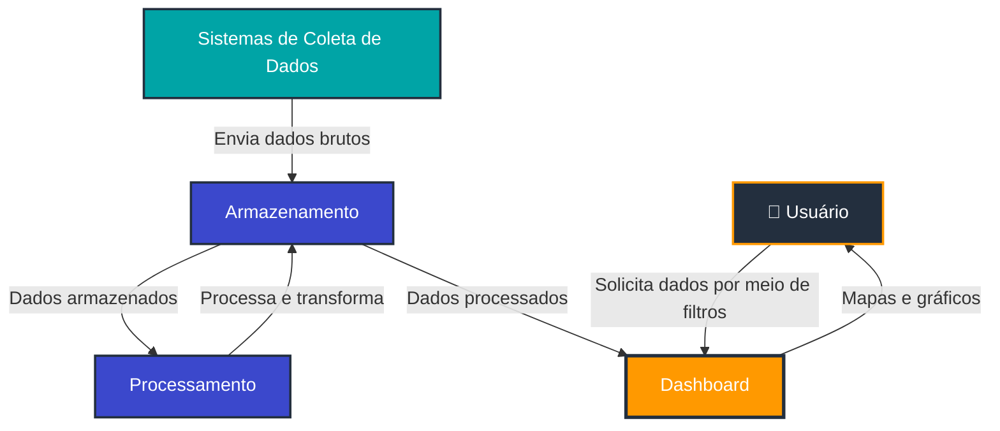

import useBaseUrl from '@docusaurus/useBaseUrl';

# Arquitetura da Aplicação - Primeira Versão

:::info
Esta é a **primeira versão** da arquitetura da aplicação e está **sujeita a mudanças** conforme o projeto evolui e novos requisitos são identificados durante o desenvolvimento.
:::

## 1. Visão Geral do Sistema

O projeto consiste no desenvolvimento de uma aplicação web para análise de dados de mídia exterior (OOH - Out of Home) para a Eletromidia. No contexto real, a empresa recebe um arquivo CSV a cada 3 meses contendo dados consolidados. No entanto, para este projeto acadêmico, **estamos simulando um cenário de API em tempo real** que envia requisições HTTP com lotes de dados várias vezes por segundo/minuto, permitindo o estudo e desenvolvimento de uma **aplicação intensiva de dados com alta volumetria**.

A arquitetura foi dividida em **dois momentos principais**:

1. **Ingestão de Dados e Armazenamento** (Data Lake e Data Warehouse)
2. **Utilização da Aplicação** (Frontend/Backend - Dashboard)

Esta divisão permite uma separação clara de responsabilidades, escalabilidade independente de cada componente e otimização específica para diferentes tipos de carga de trabalho.

