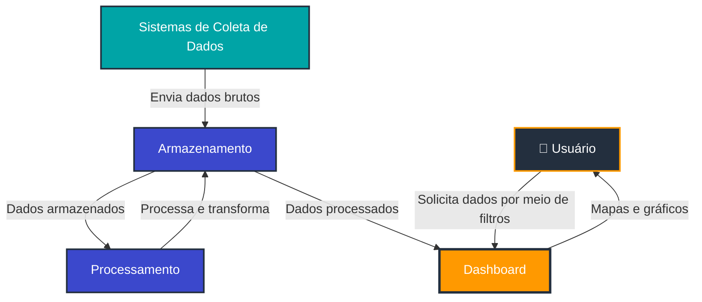
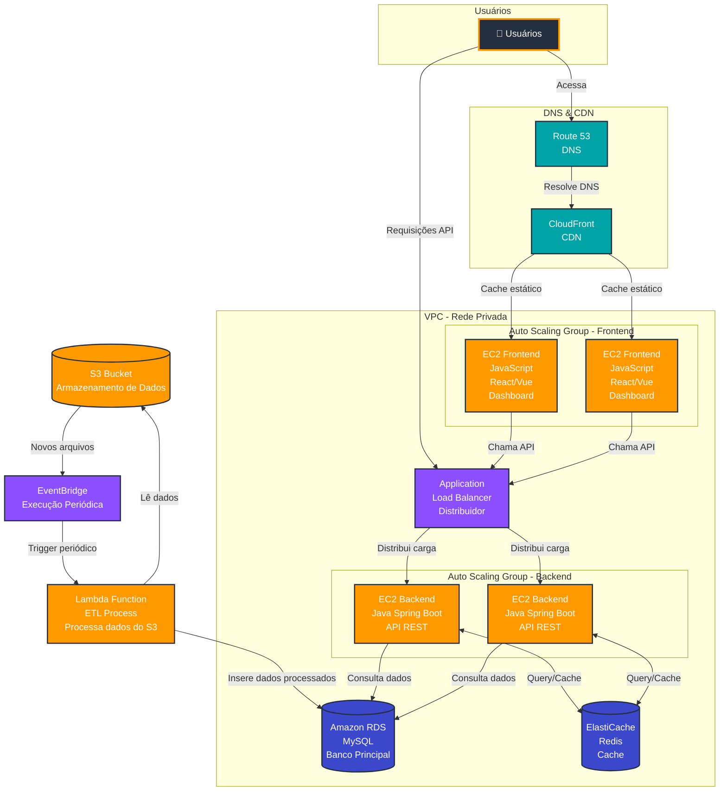

```mermaid
graph TB
    USR[👤 Usuário]
    EXT[Sistemas de Coleta de Dados]
    ARM[Armazenamento]
    PRO[Processamento]
    DASH[Dashboard]
    
    %% Fluxo de dados
    EXT -->|Envia dados brutos| ARM
    ARM -->|Dados armazenados| PRO
    PRO -->|Processa e transforma| ARM
    ARM -->|Dados processados| DASH
    USR -->|Solicita dados por meio de filtros| DASH
    DASH -->|Mapas e gráficos| USR
    
    %% Estilos
    classDef system fill:#FF9900,stroke:#232F3E,stroke-width:3px,color:#fff
    classDef external fill:#00A4A6,stroke:#232F3E,stroke-width:2px,color:#fff
    classDef users fill:#232F3E,stroke:#FF9900,stroke-width:2px,color:#fff
    classDef infra fill:#3B48CC,stroke:#232F3E,stroke-width:2px,color:#fff
    
    class DASH system
    class EXT external
    class USR users
    class ARM,PRO infra

```

```mermaid
graph TB
    subgraph "DNS & CDN"
        R53[Route 53<br/>DNS]
        CF[CloudFront<br/>CDN]
    end

    subgraph "Usuários"
        USER[👤 Usuários]
    end

    S3[(S3 Bucket<br/>Armazenamento de Dados)]
    EB[EventBridge<br/> Execução Periódica]

    LAMBDA[Lambda Function<br/>ETL Process<br/>Processa dados do S3]

    subgraph "VPC - Rede Privada"
        RDS[(Amazon RDS<br/>MySQL<br/>Banco Principal)]
        CACHE[(ElastiCache<br/>Redis<br/>Cache)]

        ALB[Application<br/>Load Balancer<br/>Distribuidor]
        
        subgraph "Auto Scaling Group - Backend"
            EC2B1[EC2 Backend<br/>Java Spring Boot<br/>API REST]
            EC2B2[EC2 Backend<br/>Java Spring Boot<br/>API REST]
        end
        
        subgraph "Auto Scaling Group - Frontend"
            EC2F1[EC2 Frontend<br/>JavaScript<br/>React/Vue<br/>Dashboard]
            EC2F2[EC2 Frontend<br/>JavaScript<br/>React/Vue<br/>Dashboard]
        end
    end

    %% Fluxo de dados
    S3 -->|Novos arquivos| EB
    EB -->|Trigger periódico| LAMBDA
    LAMBDA -->|Lê dados| S3
    LAMBDA -->|Insere dados processados| RDS

    %% Fluxo de usuário
    USER -->|Acessa| R53
    R53 -->|Resolve DNS| CF
    CF -->|Cache estático| EC2F1
    CF -->|Cache estático| EC2F2
    
    %% Fluxo de requisições
    USER -->|Requisições API| ALB
    ALB -->|Distribui carga| EC2B1
    ALB -->|Distribui carga| EC2B2
    
    EC2B1 <-->|Query/Cache| CACHE
    EC2B2 <-->|Query/Cache| CACHE
    EC2B1 -->|Consulta dados| RDS
    EC2B2 -->|Consulta dados| RDS
    
    EC2F1 -->|Chama API| ALB
    EC2F2 -->|Chama API| ALB

    %% Estilos
    classDef storage fill:#FF9900,stroke:#232F3E,stroke-width:2px,color:#fff
    classDef compute fill:#FF9900,stroke:#232F3E,stroke-width:2px,color:#fff
    classDef database fill:#3B48CC,stroke:#232F3E,stroke-width:2px,color:#fff
    classDef network fill:#8C4FFF,stroke:#232F3E,stroke-width:2px,color:#fff
    classDef cdn fill:#00A4A6,stroke:#232F3E,stroke-width:2px,color:#fff
    classDef user fill:#232F3E,stroke:#FF9900,stroke-width:3px,color:#fff

    class S3 storage
    class LAMBDA,EC2B1,EC2B2,EC2F1,EC2F2 compute
    class RDS,CACHE database
    class ALB,EB network
    class CF,R53 cdn
    class USER user
```