import useBaseUrl from '@docusaurus/useBaseUrl';

## 1. Arquitetura de Ingestão de Dados

### 1.1 Visão Geral

&emsp; A arquitetura de ingestão foi projetada para suportar **alto throughput de dados**, garantindo escalabilidade horizontal, resiliência a falhas e **processamento assíncrono**.

Neste cenário, uma API externa (simulada pela Claro) envia requisições HTTP contendo lotes de dados em alta frequência. O sistema é responsável por:

- Receber requisições de forma resiliente
- Desacoplar ingestão e processamento
- Persistir dados brutos em um Data Lake
- Disponibilizar dados estruturados para consumo analítico

A arquitetura adota um modelo orientado a eventos (*event-driven*), utilizando **filas para absorção de picos de carga** e processamento assíncrono.

### 1.2 Diagrama da Arquitetura de Ingestão - Mermaid

```mermaid
graph TB
    %% Definição de estilos
    classDef awsOrange fill:#FF9900,stroke:#232F3E,stroke-width:3px,color:#fff,font-weight:bold
    classDef awsGreen fill:#3F8624,stroke:#232F3E,stroke-width:3px,color:#fff,font-weight:bold
    classDef awsBlue fill:#527FFF,stroke:#232F3E,stroke-width:3px,color:#fff,font-weight:bold
    classDef external fill:#EC1C24,stroke:#fff,stroke-width:3px,color:#fff,font-weight:bold
    classDef iceberg fill:#00C7D4,stroke:#232F3E,stroke-width:3px,color:#fff,font-weight:bold
    classDef worker fill:#9D5025,stroke:#232F3E,stroke-width:3px,color:#fff,font-weight:bold
    
    %% API Externa
    CLARO[" API Claro<br/><br/>Envia batch de dados<br/>periodicamente"]:::external
    
    %% VPC Container
    subgraph VPC["☁️ VPC"]
        direction TB
        
        %% Camada de Entrada
        API["📡 AWS API Gateway<br/><br/>Recebe requests e<br/>encaminha para SQS"]:::awsOrange
        
        %% Camada de Processamento
        SQS["📬 Amazon SQS<br/><br/>Fila de mensagens"]:::awsOrange
        
        LAMBDA["⚡ AWS Lambda<br/><br/>Consome dados da fila,<br/>processa em lotes e<br/>armazena no datalake"]:::awsOrange
        
        %% Camada de Armazenamento
        subgraph S3_LAYER["📦 Amazon S3"]
            direction TB
            S3["☁️ S3 Bucket"]:::awsGreen
            
            subgraph DATALAKE["🗄️ Datalake - Camada RAW"]
                direction LR
                ICEBERG["❄️ Apache Iceberg<br/><br/>Dados não processados"]:::iceberg
                TABLE["📊 Tabela<br/>┌──────────┬────────┐<br/>│ PK, FK1  │ Row 1  │<br/>│ PK, FK2  │ Row 2  │<br/>│          │ Row 3  │<br/>│          │ Row 4  │<br/>└──────────┴────────┘"]:::iceberg
            end
        end
        
        %% Worker
        WORKER["⚙️ Worker ETL<br/><br/>Processa dados do lake<br/>periodicamente e faz<br/>ingestão para banco<br/>relacional/DW"]:::worker
    end
    
    %% Banco de Destino
    DB[("💾 Banco de Dados<br/>Relacional<br/><br/>Dados processados<br/>e estruturados")]:::awsBlue
    
    %% Fluxos
    CLARO -->|"HTTP POST<br/>Batch de dados"| API
    API -->|"Enfileira<br/>mensagens"| SQS
    SQS -->|"Trigger<br/>assíncrono"| LAMBDA
    LAMBDA -->|"Grava dados<br/>brutos (RAW)"| S3
    S3 -.-> DATALAKE
    DATALAKE -.->|"Leitura<br/>periódica"| WORKER
    WORKER -->|"ETL e<br/>ingestão"| DB
    
    %% Estilo da VPC
    style VPC fill:#E8F4F8,stroke:#00A1C9,stroke-width:4px,stroke-dasharray: 5 5
    style S3_LAYER fill:#F0F8F0,stroke:#3F8624,stroke-width:3px
    style DATALAKE fill:#E6F7FF,stroke:#00C7D4,stroke-width:3px
```

### 1.3 Diagrama da Arquitetura de Ingestão 

  
<strong>Figura 1 - Arquitetura de ingestão de dados</strong>

  
  
Fonte: Os autores (2026)

---

## 2. Componentes e Justificativas

### 2.1 AWS API Gateway

**Função:** Atua como porta de entrada para todas as requisições HTTP provenientes da API externa.

O API Gateway foi escolhido por oferecer uma camada gerenciada altamente escalável, capaz de lidar com grandes volumes de requisições sem necessidade de provisionamento de infraestrutura. Além disso, fornece mecanismos nativos de controle como throttling, rate limiting e validação de payload, contribuindo para a proteção da aplicação.

A integração com serviços como IAM e CloudWatch permite reforçar aspectos de segurança e observabilidade, possibilitando o monitoramento de métricas como latência, taxa de erro e throughput.

**Capacidade:**
- Suporte a até 10.000 requisições por segundo (expansível)
- Latência típica entre 20–50 ms
- Payload máximo de 10 MB
- Timeout máximo de 29 segundos

---

### 2.2 Amazon SQS (Simple Queue Service)

**Função:** Atua como camada de desacoplamento entre a ingestão de dados e o processamento.

O uso do SQS permite absorver variações de carga, garantindo que picos de requisição não impactem diretamente o processamento. A fila funciona como um buffer confiável, com alta disponibilidade e entrega garantida no modelo *at-least-once*.

Outro ponto relevante é o suporte a mecanismos de resiliência, como o *visibility timeout* e a utilização de **Dead Letter Queues (DLQ)** para tratamento de mensagens que falham após múltiplas tentativas de processamento.

**Capacidade:**
- Escalabilidade praticamente ilimitada
- Até milhares de mensagens por segundo
- Tamanho máximo de mensagem: 256 KB
- Retenção configurável entre 1 minuto e 14 dias

---

### 2.3 AWS Lambda

**Função:** Responsável por consumir mensagens da fila, processar os dados e persisti-los no Data Lake.

A utilização de Lambda permite um modelo totalmente serverless, com escalabilidade automática e cobrança baseada apenas no uso. O processamento é feito de forma assíncrona e pode ser configurado em batches, reduzindo overhead e custo operacional.

A arquitetura também se beneficia da natureza stateless da Lambda, permitindo fácil paralelização e alta capacidade de throughput. Em cenários de falha, o reprocessamento automático aliado ao SQS garante resiliência.

**Capacidade:**
- Escalabilidade automática com alta concorrência
- Timeout de até 15 minutos
- Memória configurável de 128 MB a 10 GB
- Processamento em lote configurável via integração com SQS

---

### 2.4 Amazon S3 + Apache Iceberg (Data Lake)

**Função:** Armazenar dados brutos e estruturados em um Data Lake escalável.

O Amazon S3 foi escolhido como camada de armazenamento devido à sua durabilidade, escalabilidade e baixo custo. Ele serve como base para o Data Lake, onde os dados são armazenados inicialmente na camada RAW.

Sobre o S3, é utilizado o Apache Iceberg como formato de tabela, permitindo recursos avançados como transações ACID, versionamento, evolução de schema e consultas eficientes. Isso viabiliza não apenas armazenamento, mas também leitura analítica otimizada.

A arquitetura pode ser expandida com múltiplas camadas no Data Lake:

- **RAW:** dados brutos, sem transformação  
- **TRUSTED:** dados limpos e validados  
- **REFINED:** dados agregados e prontos para consumo  

**Capacidade:**
- Durabilidade de 99.999999999% (11 noves)
- Escalabilidade praticamente ilimitada
- Alto throughput por prefixo
- Suporte a compressão e otimização de arquivos

---

### 2.5 Worker ETL

**Função:** Processar os dados armazenados no Data Lake e prepará-los para consumo analítico.

O Worker ETL opera em modelo de micro-batch, executando em intervalos definidos para transformar grandes volumes de dados de forma eficiente. Esse processo é responsável por limpeza, validação, enriquecimento e agregação dos dados.

A separação entre ingestão e transformação permite maior flexibilidade e evita impacto no fluxo de entrada de dados. Além disso, o processamento deve ser projetado de forma idempotente, garantindo consistência mesmo em cenários de reprocessamento.

**Possíveis implementações:**
- AWS Glue
- Step Functions + Lambda
- ECS/Fargate
- Apache Airflow

---

### 2.6 Banco de Dados Relacional (Data Warehouse)

**Função:** Armazenar dados estruturados e otimizados para consulta.

Após o processamento, os dados são carregados em um banco relacional ou Data Warehouse, permitindo consultas eficientes e integração com ferramentas de visualização.

Essa camada é responsável por suportar o consumo analítico, com dados organizados em modelos dimensionais (fatos e dimensões), garantindo performance e consistência.

**Opções:**
- Amazon RDS (MySQL/PostgreSQL)
- Amazon Redshift
- Amazon Aurora

---

## 3. Fluxo de Dados

O fluxo de dados segue um modelo assíncrono e desacoplado, garantindo escalabilidade e resiliência:

1. A API externa envia dados via HTTP para o API Gateway  
2. O API Gateway encaminha as requisições para o SQS (integração assíncrona)  
3. O SQS armazena temporariamente as mensagens  
4. A Lambda consome, processa e persiste os dados no S3 (camada RAW)  
5. O Worker ETL lê periodicamente os dados e realiza transformações  
6. Os dados processados são carregados no Data Warehouse  

Os dados são particionados (por exemplo, por data ou região), otimizando consultas futuras.

---

## 4. Estimativas de Capacidade e Custo

:::info Versão 1.0
Os valores abaixo são estimativas baseadas em cenários simulados e podem variar conforme a carga real.
:::

**Cenário: 1.000 requisições por segundo**

| Serviço | Capacidade | Custo Mensal Estimado |
|---------|-----------|----------------------|
| API Gateway | 2,6 bilhões req/mês | US$ 9.100 |
| SQS | 2,6 bilhões msg/mês | US$ 1.040 |
| Lambda | Processamento contínuo | US$ 4.320 |
| S3 | 100 GB/mês | ~US$ 2,30 |
| **Total** | | **~US$ 16.500/mês** |

**Observações:**

Em cenários reais, a carga tende a variar ao longo do tempo. Estratégias como batching, compressão de dados (ex: Parquet) e ajuste de memória da Lambda podem reduzir significativamente os custos operacionais.

