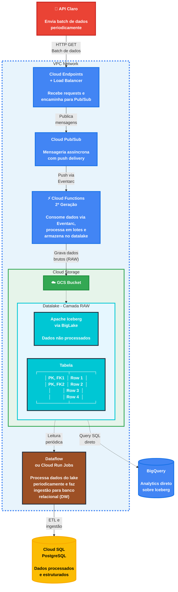

import useBaseUrl from '@docusaurus/useBaseUrl';

## 1. Visão Geral

A arquitetura de ingestão foi projetada para receber e processar alto volume de dados provenientes de uma API simulada da Claro. Neste cenário, estamos simulando que a API estará enviando requisições HTTP com lotes de dados várias vezes por segundo/minuto. O objetivo é receber, processar e armazenar esses dados de maneira eficiente em um Data Lake, utilizando o formato Apache Iceberg sobre Google Cloud Storage.

## 2. Diagrama da Arquitetura de Ingestão

  
<strong>Figura 1 - Arquitetura de ingestão de dados (GCP)</strong>

  
  
Fonte: Elaborado pelo grupo Café da Sophia (2026)

## 3. Componentes Arquiteturais

### 3.1 Cloud Endpoints + Cloud Load Balancer

**Função:** Atuar como ponto de entrada das requisições HTTP.

O Cloud Endpoints, em conjunto com o Cloud Load Balancer, é responsável por receber, validar e direcionar as requisições provenientes da API externa. Essa camada garante alta disponibilidade, distribuição de carga e controle de acesso, além de permitir observabilidade e governança das APIs.

A arquitetura utiliza esse componente como gateway de entrada, assegurando baixa latência e escalabilidade horizontal para suportar grandes volumes de requisições simultâneas.

---

### 3.2 Cloud Pub/Sub

**Função:** Desacoplar ingestão e processamento de dados.

O Pub/Sub atua como um sistema de mensageria baseado no paradigma publish/subscribe, onde mensagens são publicadas em um tópico e distribuídas para múltiplos consumidores.

Essa abordagem permite absorver picos de carga e processar dados de forma assíncrona. Diferentemente de soluções baseadas em polling, o Pub/Sub utiliza **push delivery**, reduzindo latência e custo operacional.

Além disso, suporta mecanismos de resiliência como retry automático e **Dead Letter Topics (DLQ)** para tratamento de falhas.

---

### 3.3 Cloud Functions (2ª Geração)

**Função:** Processar eventos e persistir dados no Data Lake.

O Cloud Functions (2ª geração) consome eventos do Pub/Sub via Eventarc, executando o processamento de forma totalmente serverless.

A segunda geração oferece maior capacidade de concorrência por instância, reduzindo a necessidade de escala horizontal agressiva e minimizando o impacto de cold starts. Isso resulta em melhor eficiência de custo e performance.

A execução é configurável em termos de memória e tempo, permitindo o processamento de cargas mais pesadas em comparação com soluções tradicionais serverless.

---

### 3.4 Cloud Storage + Apache Iceberg via BigLake (Data Lake)

**Função:** Armazenar dados brutos e suportar consultas analíticas.

O Cloud Storage atua como base do Data Lake, oferecendo alta durabilidade e escalabilidade praticamente ilimitada. Sobre ele, o Apache Iceberg, integrado via BigLake, fornece recursos modernos como transações ACID, versionamento e evolução de schema.

Essa combinação permite executar consultas SQL diretamente via BigQuery, eliminando a necessidade de serviços adicionais para leitura analítica e simplificando a arquitetura.

A estrutura do Data Lake pode ser organizada em múltiplas camadas:

- **RAW:** dados brutos  
- **TRUSTED:** dados limpos e validados  
- **REFINED:** dados agregados e prontos para consumo  

---

### 3.5 Worker ETL (Dataflow ou Cloud Run Jobs)

**Função:** Transformar e preparar dados para consumo.

O processamento ETL é realizado de forma desacoplada da ingestão, permitindo maior flexibilidade e escalabilidade. O pipeline lê dados do Data Lake, aplica transformações e carrega os dados processados no banco relacional.

Esse processo pode ser executado em modelo de micro-batch, com agendamento periódico via Cloud Scheduler.

Para implementação:
- **Dataflow:** indicado para cenários com alto volume ou necessidade de streaming (Apache Beam)  
- **Cloud Run Jobs:** adequado para cargas mais simples baseadas em containers  

O processamento deve ser projetado de forma **idempotente**, evitando inconsistências em reprocessamentos.

---

### 3.6 Banco de Dados Relacional (Cloud SQL / AlloyDB)

**Função:** Armazenar dados estruturados para consumo analítico.

Após o processamento, os dados são persistidos em um banco relacional otimizado para leitura. O uso de índices e constraints garante consistência e performance nas consultas.

O Cloud SQL (PostgreSQL) é recomendado como solução inicial pela simplicidade operacional e robustez. Em cenários de maior exigência, o AlloyDB pode ser utilizado como evolução, oferecendo maior throughput e performance.

---

## 4. Fluxo de Dados

O fluxo de ingestão segue um modelo assíncrono e orientado a eventos:

1. A API externa envia dados via HTTP para o Cloud Endpoints  
2. O Endpoints publica as mensagens em um tópico Pub/Sub  
3. O Pub/Sub aciona o Cloud Functions via push (Eventarc)  
4. O Cloud Functions processa e persiste os dados no Cloud Storage (camada RAW)  
5. O Worker ETL executa periodicamente, lendo dados via BigQuery/BigLake  
6. Os dados transformados são carregados no Cloud SQL  

Os dados são particionados (por exemplo, por data ou região), otimizando consultas e reduzindo custo de leitura.

---

## 5. Estimativas de Capacidade e Custo

:::info Versão 2.0
Os valores abaixo são estimativas baseadas em cenários simulados e podem variar conforme a carga real.
:::

**Cenário:** 1.000 requisições por segundo

| Serviço | Capacidade | Custo Mensal Estimado |
|---------|-----------|----------------------|
| Endpoints + Load Balancer | 2,6 bilhões req/mês | US$ 7.800 |
| Pub/Sub | 2,6 bilhões msg/mês | ~US$ 354 |
| Cloud Functions (2ª Gen) | Processamento contínuo | ~US$ 2.015 |
| Cloud Storage | 100 GB/mês | ~US$ 2,00 |
| **Total** | | **~US$ 10.200/mês** |

**Observações:**

Em cenários reais, a carga tende a ser variável. Estratégias como compressão de dados, particionamento eficiente e ajuste de concorrência das funções podem reduzir significativamente os custos operacionais.

---