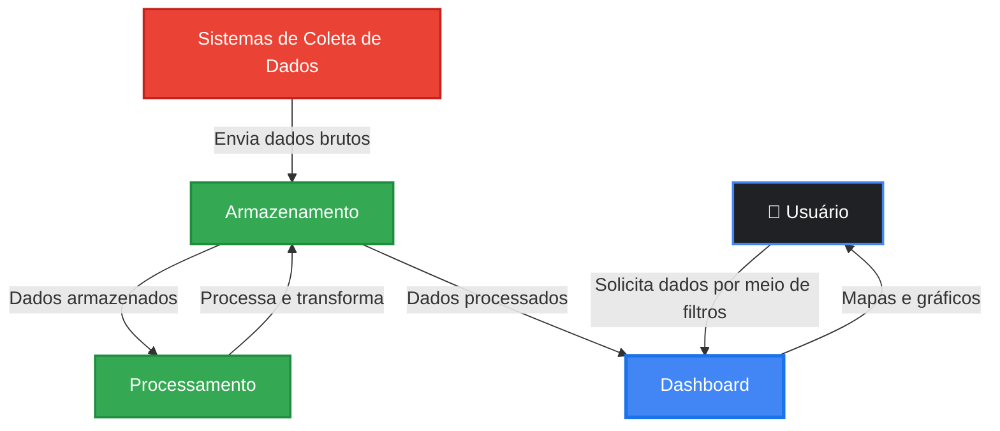
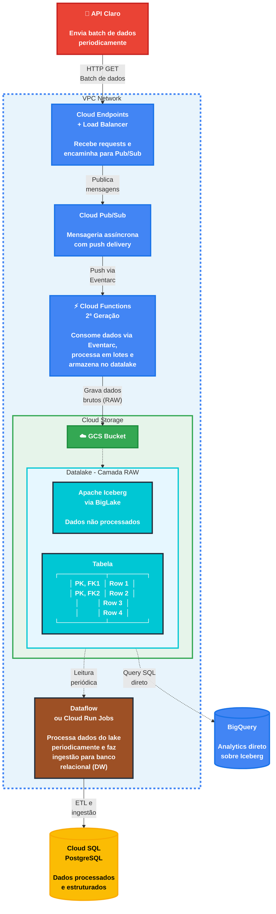
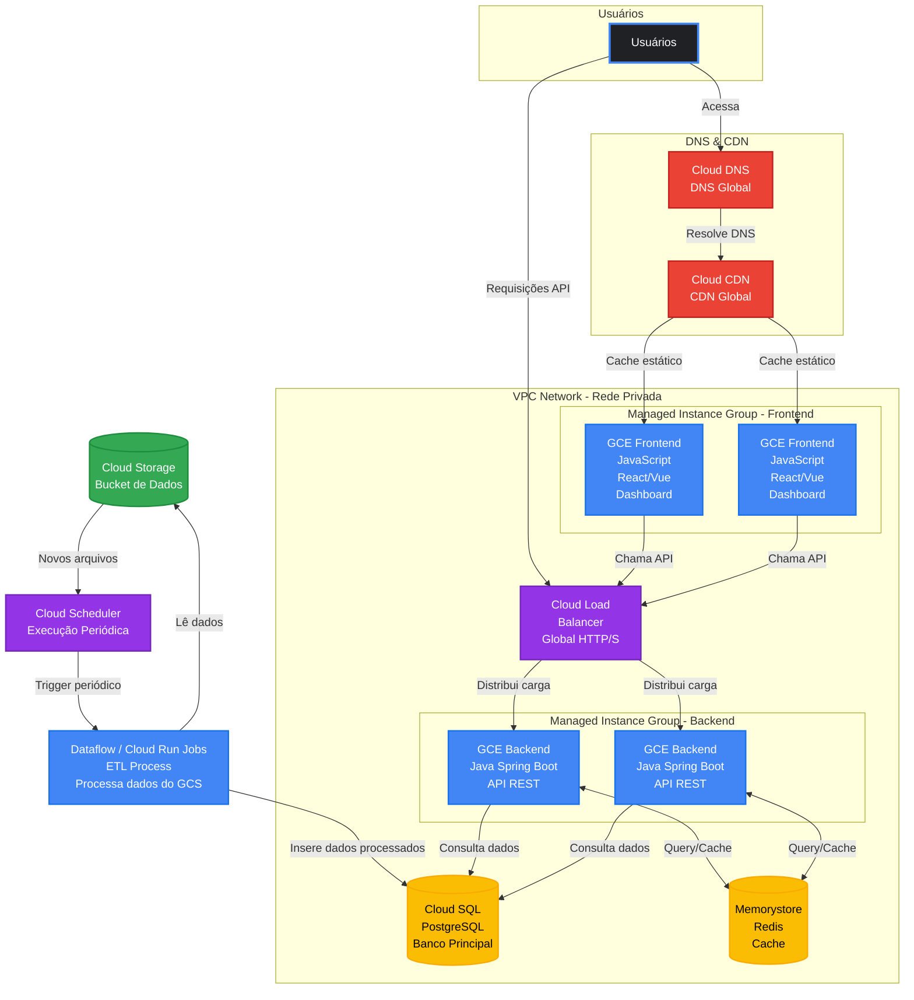

import useBaseUrl from '@docusaurus/useBaseUrl';

# Arquitetura da Aplicação - Versão GCP

:::info
Esta é a **versão 2.0** da arquitetura da aplicação, **migrada para Google Cloud Platform (GCP)**. Esta versão representa uma evolução da arquitetura original AWS, mantendo os mesmos princípios de escalabilidade e alta disponibilidade, com otimizações específicas do ecossistema Google Cloud.
:::

## Visão Geral do Sistema

O projeto consiste no desenvolvimento de uma aplicação web para análise de dados de mídia exterior (OOH - Out of Home) para a Eletromidia. No contexto real, a empresa recebe um arquivo CSV a cada 3 meses contendo dados consolidados. No entanto, para este projeto acadêmico, **estamos simulando um cenário de API em tempo real** que envia requisições HTTP com lotes de dados várias vezes por segundo/minuto, permitindo o estudo e desenvolvimento de uma **aplicação intensiva de dados com alta volumetria**.

A arquitetura foi dividida em **dois momentos principais**:

1. **Ingestão de Dados e Armazenamento** (Data Lake e Data Warehouse)
2. **Utilização da Aplicação** (Frontend/Backend - Dashboard)

Esta divisão permite uma separação clara de responsabilidades, escalabilidade independente de cada componente e otimização específica para diferentes tipos de carga de trabalho.

---

## Migração de AWS para GCP

:::tip Por que migrar para GCP?
A decisão de migrar para Google Cloud Platform foi baseada na atual stack tecnológica do parceiro de projeto, Eletromídia. Dessa forma, a fins de aprendizado e compatibilidade com o parceiro, alteramos a arquitetura para a versão 2.0, utilizando o ambiente Google Cloud Platform. Esta seção documenta as principais motivações e trade-offs envolvidos.
:::

---

## 1. Arquitetura de Ingestão de Dados

### 1.1 Visão Geral

A arquitetura de ingestão foi projetada para receber e processar alto volume de dados provenientes de uma API simulada da Claro. Neste cenário, estamos simulando que a API estará enviando requisições HTTP com lotes de dados várias vezes por segundo/minuto. O objetivo é receber, processar e armazenar esses dados de maneira eficiente em um Data Lake, utilizando o formato Apache Iceberg sobre Google Cloud Storage.

### 1.2 Diagrama da Arquitetura de Ingestão

  
<strong>Figura 1 - Arquitetura de ingestão de dados (GCP)</strong>

  
  
Fonte: Elaborado pelo grupo Café da Sophia (2026)

### 1.3 Componentes arquiteturais

#### 1.3.1 Cloud Endpoints + Cloud Load Balancer

&emsp; A utilização do Google Cloud Endpoints, junto ao Google Cloud Load Balancer é fundamental para o processamento das requisições feitas à nossa camada de ingestão de dados (considerando POST via API da Claro), servindo como ponto de entrada das requisições HTTP ao sistema.

#### 1.3.2 Cloud Pub/Sub

&emsp; Sistema de mensageria que atua como buffer entre o Google Cloud Endpoints e o processamento via Google Cloud Functions. O funcionamento é baseado no paradigma Pub/Sub, em que um *Tópico* recebe as requisições (Pub) e distribui para todos os *Subscribers* inscritos no tópico. Dessa forma, permite que a ingestão e o processamento dos dados operem em velocidades diferentes. O uso do Pub/Sub ainda fornece uma vantagem sobre a proposta anterior, que utilizava SQS: o push delivery nativo elimina a necessidade de polling constante, reduzindo latência e custos.

#### 1.3.3 Cloud Functions (2ª Geração)

&emsp; Função serverless que consome mensagens do Pub/Sub via Eventarc, processa os dados em lotes e armazena no Data Lake (Cloud Storage). A segunda geração do Cloud Functions oferece escalabilidade automática de 0 a mais de 1.000 instâncias concorrentes, com até 1.000 requisições simultâneas por instância — uma melhoria significativa em relação ao Lambda, que suporta apenas uma por instância. Isso significa menos instâncias necessárias para a mesma carga, o que reduz cold starts e custos. A infraestrutura é totalmente gerenciada pelo Google, com timeout configurável de até 60 minutos e memória ajustável de até 32GB, garantindo flexibilidade para processamento de lotes pesados.

#### 1.3.4 Cloud Storage + Apache Iceberg via BigLake (Data Lake)

&emsp; O Cloud Storage atua como camada de armazenamento de dados brutos (RAW), oferecendo durabilidade de 11 noves (99.999999999%) e escalabilidade praticamente ilimitada a baixo custo. Sobre ele, utilizamos o formato de tabela Apache Iceberg integrado via BigLake, que fornece transações ACID, evolução de schema e versionamento de dados sem necessidade de reescrever arquivos existentes. A principal vantagem dessa combinação é a possibilidade de executar queries SQL diretamente via BigQuery sobre as tabelas Iceberg, sem necessidade de configurar um serviço separado como o Athena na proposta anterior. O BigLake também oferece governança centralizada com controle de acesso granular via IAM e compatibilidade com Spark, Dataflow e Dataproc.

#### 1.3.5 Worker ETL (Dataflow ou Cloud Run Jobs)

&emsp; Processo periódico responsável por ler dados da camada RAW do Data Lake, aplicar transformações (limpeza, validação, enriquecimento e agregações) e carregar os dados processados no banco relacional. Essa separação entre ingestão e processamento analítico permite que cada etapa escale independentemente e que o ETL seja executado via Cloud Scheduler em horários de menor carga. A recomendação é utilizar Dataflow para cenários que exigem processamento unificado de batch e streaming via Apache Beam, ou Cloud Run Jobs para transformações mais simples baseadas em containers.

#### 1.3.6 Banco de Dados Relacional (Cloud SQL / AlloyDB)

&emsp; Armazena os dados já processados e estruturados, otimizados para consultas analíticas rápidas e alimentação do dashboard. O schema definido com índices e constraints garante integridade e performance nas leituras. A recomendação é utilizar Cloud SQL PostgreSQL como banco principal do dashboard, dado que é um serviço gerenciado, familiar e robusto. Caso a performance se torne crítica para workloads analíticos pesados, AlloyDB serve como upgrade direto, oferecendo compatibilidade com PostgreSQL e performance até 4 vezes superior.

### 1.4 Fluxo de Dados Detalhado

1. **API Claro para Cloud Endpoints (HTTP POST):** A API externa envia lotes de dados via HTTP POST. O Cloud Endpoints valida a requisição e retorna 200 OK imediatamente, com latência típica de 10-30ms.

2. **Cloud Endpoints para Pub/Sub (Publicação):** O Cloud Endpoints publica a mensagem no tópico Pub/Sub de forma assíncrona, sem bloquear a resposta ao cliente. A mensagem fica retida no tópico até ser processada, com retenção de até 31 dias.

3. **Pub/Sub para Cloud Functions (Push via Eventarc):** O Cloud Functions é acionado automaticamente via push, sem necessidade de polling. Processa múltiplas mensagens concorrentemente (até 1000 por instância). Em caso de erro, a mensagem é enviada para um Dead Letter Topic com retry automático.

4. **Cloud Functions para Cloud Storage (Gravação de dados brutos):** O Cloud Functions valida e transforma os dados conforme necessário, grava no formato Apache Iceberg no Cloud Storage e particiona por data/hora para otimizar consultas futuras.

5. **Worker ETL (Leitura periódica via Cloud Scheduler):** Executa em intervalos regulares (ex: a cada hora), lê novos dados da camada RAW via BigQuery sobre BigLake e aplica transformações, agregações e limpeza.

6. **Worker para Cloud SQL (ETL e ingestão):** Carrega dados processados no banco relacional, atualiza tabelas dimensionais e fatos, e disponibiliza os dados para consulta pelo dashboard.

### 1.5 Estimativas de Capacidade e Custo

:::info Versão 2.0
Os valores abaixo são estimativas baseadas em cenários simulados e preços GCP de fevereiro/2026, sujeitos a ajustes conforme a volumetria real do projeto.
:::

**Cenário de exemplo: 1.000 requisições por segundo**

| Serviço GCP | Capacidade | Custo Mensal Estimado |
|-------------|-----------|----------------------|
| Cloud Endpoints + LB | 1.000 req/s = 2,6 bilhões/mês | US$ 7.800 |
| Cloud Pub/Sub | 1.000 msg/s = 2,6 bilhões/mês | US$ 104 + US$ 250 (data) = US$ 354 |
| Cloud Functions 2ª Gen (500ms, 1GB) | 2,6 bilhões invocações | US$ 1.040 + US$ 975 = US$ 2.015 |
| Cloud Storage (100GB novos/mês) | 100GB storage + transfer | US$ 2,00 + transfer |
| **Total** | | **~US$ 10.200/mês** |

---

## 2. Arquitetura da Aplicação (Dashboard)

### 2.1 Visão Geral

Esta segunda parte da arquitetura é responsável pela **interface de usuário e processamento de requisições** dos analistas da Eletromidia. O sistema precisa suportar **altos volumes de requisições simultâneas**, pois múltiplos usuários estarão acessando dashboards, gerando relatórios e aplicando filtros complexos sobre grandes conjuntos de dados.

### 2.2 Diagrama da Arquitetura da Aplicação

### 2.3 Componentes e Justificativas

#### 2.3.1 Cloud DNS

&emsp; Serviço de DNS que resolve o nome de domínio da aplicação para os endereços IP corretos. Oferece SLA de 100% de disponibilidade com rede global Anycast em mais de 200 pontos de presença, garantindo latência de consulta geralmente inferior a 10ms. Possui suporte nativo a DNSSEC para segurança DNS e integração direta com o Cloud Load Balancer e demais serviços GCP.

#### 2.3.2 Cloud CDN

&emsp; Content Delivery Network que distribui conteúdo estático (HTML, CSS, JS, imagens) globalmente a partir de mais de 200 edge locations. Utiliza a rede privada global do Google em vez da internet pública, o que resulta em menor latência e maior confiabilidade. Oferece cache inteligente com compressão automática (Gzip/Brotli), certificados SSL/TLS gratuitos via Google-managed certificates e integração com Cloud Armor para proteção DDoS e WAF.

#### 2.3.3 Cloud Load Balancer

&emsp; Distribui requisições HTTP/HTTPS entre múltiplas instâncias GCE de backend e frontend. É global por padrão, com um único IP anycast e roteamento automático para a zona mais próxima do usuário. Realiza health checks contínuos para remover instâncias não saudáveis do pool e escala automaticamente para suportar milhões de requisições por segundo. Também oferece SSL/TLS offloading com certificados gerenciados e integração nativa com Cloud Armor para proteção contra ataques.

#### 2.3.4 Managed Instance Groups (Backend e Frontend)

&emsp; Gerencia automaticamente o número de instâncias GCE baseado em métricas de carga. Adiciona instâncias durante picos de demanda e remove quando a carga diminui, garantindo custo-eficiência. As instâncias são distribuídas em múltiplas zonas automaticamente para alta disponibilidade, com self-healing que substitui instâncias não saudáveis e suporte a rolling updates para deploys sem downtime. A configuração típica mantém um mínimo de 2 instâncias para alta disponibilidade, escalando até 10 ou mais em picos de carga.

#### 2.3.5 GCE Backend (Java Spring Boot - API REST)

&emsp; Servidores de aplicação que processam a lógica de negócio e servem a API REST utilizando Spring Boot, um framework maduro e robusto. As instâncias são stateless, ou seja, não mantêm estado local, o que facilita a escalabilidade horizontal com múltiplas instâncias processando requisições em paralelo. A arquitetura baseada em containers permite migração futura para Cloud Run ou GKE caso necessário.

#### 2.3.6 GCE Frontend (React/Vue - Dashboard)

&emsp; Servidores que hospedam a aplicação Single Page Application (SPA) do dashboard, utilizando React ou Vue para uma experiência de usuário fluida com componentização e gerenciamento de estado. A aplicação integra bibliotecas de visualização de dados como D3.js e Chart.js para gráficos, além do Google Maps Platform para visualização geográfica. Como otimização recomendada, o frontend pode ser hospedado diretamente no Cloud Storage com Cloud CDN, eliminando a necessidade de instâncias GCE dedicadas e reduzindo significativamente custos e complexidade.

#### 2.3.7 Cloud SQL PostgreSQL

&emsp; Banco de dados relacional principal que armazena os dados processados vindos do Data Warehouse. É um serviço totalmente gerenciado pelo Google, incluindo backups automáticos com point-in-time recovery de até 365 dias, patches e failover automático com SLA de 99.95%. Suporta read replicas para distribuir carga de leitura, escalabilidade vertical sem downtime e criptografia tanto em repouso quanto em trânsito, com acesso restrito via Private IP.

#### 2.3.8 Memorystore for Redis

&emsp; Cache distribuído em memória que reduz a latência das respostas para menos de 1ms e diminui a carga no Cloud SQL em 80-95% das queries. Armazena resultados de queries complexas, dados de sessão de usuários, agregações e métricas pré-calculadas e configurações da aplicação. O Standard Tier oferece réplica automática com failover para alta disponibilidade, e o acesso é restrito à VPC via Private IP para maior segurança.

#### 2.3.9 Dataflow / Cloud Run Jobs (Worker ETL)

&emsp; Processo serverless que lê dados periodicamente do Cloud Storage (Data Lake) e insere no Cloud SQL, acionado por Cloud Scheduler em horários programados. Escala automaticamente conforme o volume de dados e cobra apenas pelo tempo de execução. Para ETL complexo com necessidade de processamento unificado de batch e streaming, recomenda-se Dataflow com Apache Beam. Para transformações mais simples baseadas em containers, Cloud Run Jobs é a opção mais adequada.

#### 2.3.10 Cloud Scheduler

&emsp; Serviço de agendamento que dispara execuções periódicas do ETL utilizando cron expressions. Pode acionar HTTP endpoints, Pub/Sub ou Cloud Functions, com retry automático em caso de falhas. É um serviço de baixo custo, com 3 jobs gratuitos por mês.

### 2.4 Fluxo de Requisições

#### 2.4.1 Fluxo do Usuário (Frontend)

&emsp; O usuário acessa a URL da aplicação, que é resolvida pelo Cloud DNS para o IP global do Cloud CDN/Load Balancer. O Cloud CDN verifica se o conteúdo solicitado está em cache — se estiver, retorna diretamente com latência de 5-30ms. Caso contrário, busca o conteúdo do origin (GCE ou Cloud Storage), armazena em cache para próximas requisições e retorna ao usuário com latência de 100-300ms.

#### 2.4.2 Fluxo de Requisições API

&emsp; O frontend SPA faz requisições Ajax/Fetch para a API, que são recebidas pelo Cloud Load Balancer via IP anycast global. O Load Balancer escolhe uma instância backend saudável e encaminha a requisição para a zona mais próxima. O backend primeiro verifica o Memorystore — se a resposta estiver em cache, retorna imediatamente em menos de 1ms. Em caso de cache miss, consulta o Cloud SQL, executa a query, armazena o resultado no cache e retorna a resposta. Tempos de resposta típicos variam de 5-20ms (cache hit) a 200-1000ms (query complexa sem cache).

#### 2.4.3 Fluxo ETL (Background)

&emsp; O Cloud Scheduler dispara o job de ETL no horário agendado. O job lê novos dados do Data Lake via BigQuery sobre BigLake, aplica transformações e insere ou atualiza os dados no Cloud SQL usando batch inserts para performance. A duração típica varia de 1 a 10 minutos dependendo do volume de dados.

### 2.5 Justificativa para Suportar Alto Volume de Requisições

&emsp; A arquitetura foi desenhada para alta volumetria por meio de escalabilidade horizontal com Managed Instance Groups que adicionam instâncias automaticamente, cache em múltiplas camadas (Cloud CDN para conteúdo estático na edge global e Memorystore para dados dinâmicos, reduzindo 80-95% da carga no banco), load balancing global que suporta milhões de requisições por segundo, arquitetura stateless que facilita o scaling horizontal, serviços gerenciados com SLAs garantidos pelo Google, e separação de responsabilidades entre frontend e backend em grupos independentes que podem escalar separadamente.

### 2.6 Estimativa de Capacidade Total

**Cenário: 1.000 usuários simultâneos, 10 req/s por usuário**

| Camada | Capacidade | Custo Mensal |
|--------|-----------|-------------|
| Cloud DNS | Ilimitado | US$ 0,20 |
| Cloud CDN | 10TB transferência | US$ 800 |
| Cloud Load Balancer | Milhões req/s | US$ 50 |
| GCE Backend (4x e2-medium) | 1.600 req/s | US$ 97 |
| GCE Frontend (2x e2-small) | 2.000 req/s | US$ 24 |
| Cloud SQL (db-n1-standard-2) | HA Regional | US$ 187 |
| Memorystore Redis (5GB Standard) | 100.000 ops/s | US$ 353 |
| Dataflow + Cloud Scheduler | 100 execuções/dia | US$ 50 |
| **Total** | | **~US$ 1.561/mês** |

## 3. Considerações Finais

:::warning Versão 2.0
Esta documentação representa a **versão 2.0** da arquitetura, migrada para GCP. Está sujeita a mudanças conforme testes de carga revelam gargalos, requisitos de negócio evoluem, novos serviços GCP são considerados e feedback dos stakeholders é incorporado.
:::

### 3.1 Próximos Passos

1. **Validação com PoC:** Implementar arquitetura mínima para validar premissas
2. **Testes de carga:** Validar capacidade e identificar gargalos com Cloud Load Testing
3. **Otimização de custos:** Ajustar tipos de instância e implementar committed use discounts
4. **Segurança:** Implementar Cloud Armor (WAF), VPC Service Controls, IAM com least privilege
5. **Disaster Recovery:** Definir RPO/RTO e implementar backups cross-region
6. **CI/CD:** Automatizar deploy com Cloud Build ou GitHub Actions

### 3.3 Recursos de Aprendizado

- [Google Cloud Architecture Framework](https://cloud.google.com/architecture/framework)
- [GCP Solutions](https://cloud.google.com/solutions)
- [Cloud Skills Boost](https://www.cloudskillsboost.google/)
- [GCP Pricing Calculator](https://cloud.google.com/products/calculator)
