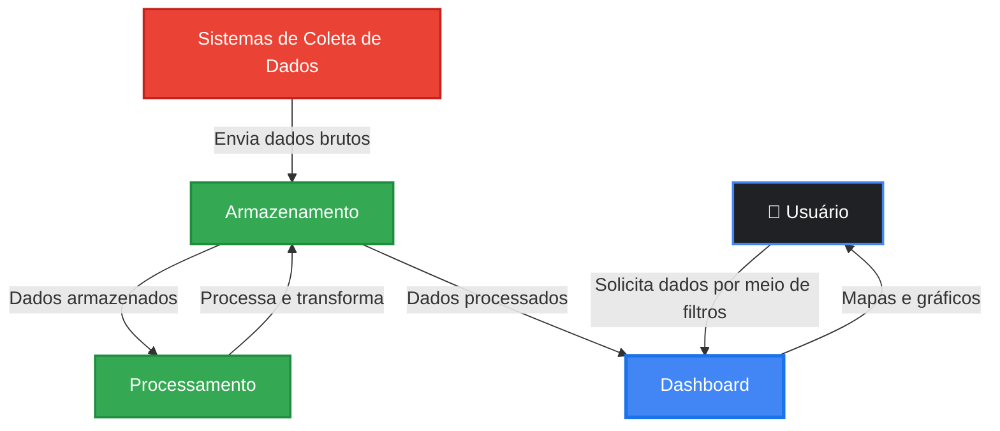
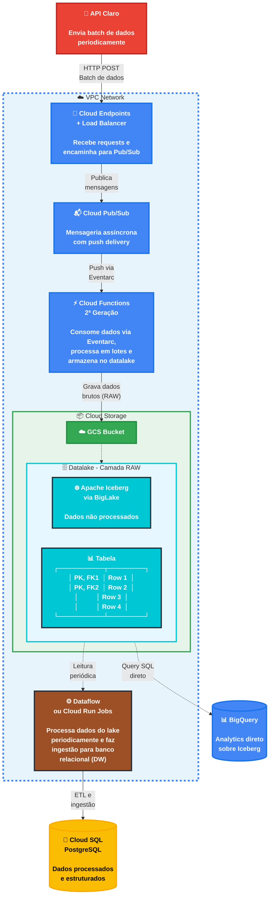

import useBaseUrl from '@docusaurus/useBaseUrl';

# Arquitetura da Aplicação - Versão GCP

:::info
Esta é a **versão 2.0** da arquitetura da aplicação, **migrada para Google Cloud Platform (GCP)**. Esta versão representa uma evolução da arquitetura original AWS, mantendo os mesmos princípios de escalabilidade e alta disponibilidade, com otimizações específicas do ecossistema Google Cloud.
:::

## Visão Geral do Sistema

O projeto consiste no desenvolvimento de uma aplicação web para análise de dados de mídia exterior (OOH - Out of Home) para a Eletromidia. No contexto real, a empresa recebe um arquivo CSV a cada 3 meses contendo dados consolidados. No entanto, para este projeto acadêmico, **estamos simulando um cenário de API em tempo real** que envia requisições HTTP com lotes de dados várias vezes por segundo/minuto, permitindo o estudo e desenvolvimento de uma **aplicação intensiva de dados com alta volumetria**.

A arquitetura foi dividida em **dois momentos principais**:

1. **Ingestão de Dados e Armazenamento** (Data Lake e Data Warehouse)
2. **Utilização da Aplicação** (Frontend/Backend - Dashboard)

Esta divisão permite uma separação clara de responsabilidades, escalabilidade independente de cada componente e otimização específica para diferentes tipos de carga de trabalho.



---

## Contexto da Migração: AWS → GCP

:::tip Por que migrar para GCP?
A decisão de migrar para Google Cloud Platform foi baseada na atual stack tecnológica do parceiro de projeto, Eletromídia. Dessa forma, a fins de aprendizado e compatibilidade com o parceiro, alteramos a arquitetura para a versão 2.0, utilizando o ambiente Google Cloud Platform. Esta seção documenta as principais motivações e trade-offs envolvidos.
:::

### Prévia de resultados da migração

| Aspecto | Justificativa |
|---------|---------------|
| **Integração com BigQuery** | Analytics nativo sobre o datalake sem necessidade de ETL adicional |
| **Custo operacional** | Economia estimada de ~14% em custos mensais |
| **Simplificação** | Cloud Functions com concorrência nativa reduz número de instâncias |
| **BigLake + Iceberg** | Suporte nativo a Apache Iceberg com governança unificada |
| **Pub/Sub** | Mensageria com push nativo, eliminando polling constante |

---

## 1. Arquitetura de Ingestão de Dados

### 1.1 Visão Geral

A arquitetura de ingestão foi projetada para **receber e processar alto volume de dados** provenientes de uma API simulada da Claro. Neste cenário, estamos simulando que a API estará enviando requisições HTTP com lotes de dados várias vezes por segundo/minuto. O objetivo é receber, processar e armazenar esses dados de maneira eficiente em um Data Lake, utilizando o formato Apache Iceberg sobre Google Cloud Storage.

### 1.2 Diagrama da Arquitetura de Ingestão



<div style={{ textAlign: 'center' }}>
  <p><strong>Figura 1 - Arquitetura de ingestão de dados (GCP)</strong></p>
  
  <p>Fonte: Elaborado pelo grupo Café da Sophia (2026)</p>
</div>


### 1.3 Componentes arquiteturais

#### 1.3.1 Cloud Endpoints + Cloud Load Balancer

**Função:** Porta de entrada para todas as requisições HTTP vindas da API simulada da Claro.

**Justificativa:**
- **Escalabilidade:** Suporta **milhões de requisições por segundo** com escalonamento automático global
- **Custo-benefício:** US$ 3,00 por milhão de requisições (ligeiramente inferior ao API Gateway AWS)
- **Gerenciamento:** Oferece throttling, rate limiting e validação de requisições via OpenAPI/Swagger
- **Segurança:** Integração nativa com Cloud IAM, API Keys, OAuth 2.0 e Cloud Armor (WAF)
- **Monitoramento:** Integração com Cloud Monitoring e Cloud Logging para métricas e traces
- **ESP (Extensible Service Proxy):** Proxy baseado em Envoy para controle granular

**Capacidade:**
- Latência típica: 10-30ms
- Payload máximo: 32MB por requisição
- Timeout configurável: até 1 hora

**Alternativa considerada:** Apigee (plataforma enterprise completa para gestão de APIs, recomendada se houver necessidade de monetização ou analytics um pouco maisavançados de API).

#### 1.3.2 Cloud Pub/Sub

**Função:** Sistema de mensageria que atua como buffer entre o Cloud Endpoints e o processamento via Cloud Functions.

**Justificativa:**
- **Desacoplamento:** Permite que a ingestão e o processamento operem em velocidades diferentes
- **Alta disponibilidade:** SLA de 99.95%, com replicação automática em múltiplas zonas
- **Escalabilidade ilimitada:** Suporta **praticamente ilimitadas** mensagens, sem throttling
- **Throughput:** Sem limite de mensagens por segundo (escala automaticamente)
- **Custo:** US$ 0,04 por milhão de mensagens + US$ 0,05/GB de dados entregues
- **Delivery modes:** Push (recomendado) e Pull, eliminando necessidade de polling
- **Exactly-once delivery:** Disponível para garantir processamento único
- **Dead Letter Topics:** Suporte nativo para mensagens que falharam

**Capacidade:**
- Tamanho máximo de mensagem: **10MB** (40x maior que SQS)
- Retenção: até 31 dias (configurável)
- Ordering keys: Garantia de ordem quando necessário

**O uso do Pub/Sub ainda fornece uma vantagem sobre SQS:** Push delivery nativo elimina a necessidade de polling constante, reduzindo latência e custos.

#### 1.3.3 Cloud Functions (2ª Geração)

**Função:** Função serverless que consome mensagens do Pub/Sub via Eventarc, processa os dados em lotes e armazena no Data Lake (Cloud Storage).

**Justificativa:**
- **Escalabilidade automática:** Escala automaticamente de 0 a **1.000+ instâncias concorrentes**
- **Concorrência por instância:** Até **1.000 requisições simultâneas por instância** (vs 1 no Lambda)
- **Custo:** US$ 0,40 por milhão de invocações + US$ 0,0000025 por GB-segundo + US$ 0,00001 por vCPU-segundo
- **Camada gratuita:** 2 milhões de invocações gratuitas por mês
- **Sem gerenciamento de servidor:** Infraestrutura totalmente gerenciada pelo Google
- **Timeout configurável:** Até **60 minutos** por execução (vs 15 min no Lambda)
- **Memória ajustável:** 128MB a **32GB** (vs 10GB no Lambda)
- **vCPUs:** Até 8 vCPUs por instância

**Capacidade:**
- Throughput: **Dezenas de milhares de requisições por segundo** com concorrência adequada
- Payload de resposta: 10MB
- Processamento via Eventarc: Integração nativa com Pub/Sub, sem configuração adicional

**Vantagem sobre Lambda:** A concorrência de até 1000 req/instância significa que menos instâncias são necessárias, reduzindo cold starts e custos.

#### 1.3.4 Cloud Storage + Apache Iceberg via BigLake (Data Lake)

**Função:** Armazenamento de dados brutos (RAW) no formato Apache Iceberg, criando um Data Lake escalável e de baixo custo, com query direta via BigQuery.

**Justificativa do Cloud Storage:**
- **Durabilidade:** 99.999999999% (11 noves) de durabilidade
- **Disponibilidade:** 99.99% de disponibilidade (Standard)
- **Escalabilidade ilimitada:** Pode armazenar quantidades ilimitadas de dados
- **Custo:** US$ 0,020 por GB/mês (Standard) - **13% mais barato que S3**
- **Performance:** Suporta **5.000 requisições de PUT/COPY/POST/DELETE** e **8.000 requisições GET/HEAD por segundo por prefixo**
- **Classes de storage:** Standard, Nearline, Coldline, Archive (lifecycle automático)

**Justificativa do Apache Iceberg via BigLake:**
- **Formato de tabela moderno:** Suporta transações ACID, schema evolution e time travel
- **BigLake integration:** Query SQL direta via BigQuery sobre tabelas Iceberg
- **Performance:** Permite leituras eficientes através de partition pruning e metadata caching
- **Evolução de schema:** Adicionar, remover ou renomear colunas sem reescrever dados
- **Versionamento:** Mantém histórico de alterações para auditoria e rollback
- **Compatibilidade:** Funciona com Spark, Dataflow, Dataproc e BigQuery
- **Governança:** Metastore gerenciado com controle de acesso granular via IAM

**Capacidade:**
- Throughput de transferência: Até **100 Gbps** por bucket
- Operações de listagem: 8.000 por segundo por prefixo
- Compactação de dados: Reduz custos de storage e melhora performance de queries

**Vantagem sobre S3 + Athena proposto anteriormente:** Com BigLake, você pode fazer queries SQL diretamente via BigQuery sobre tabelas Iceberg, sem necessidade de configurar Athena ou pagar por dados escaneados separadamente.

#### 1.3.5 Worker ETL (Dataflow ou Cloud Run Jobs)

**Função:** Processo periódico que lê dados da camada RAW do Data Lake, realiza transformações (ETL) e carrega os dados processados no Data Warehouse/Banco Relacional.

**Justificativa:**
- **Separação de responsabilidades:** Desacopla a ingestão do processamento analítico
- **Processamento em batch:** Permite transformações complexas em grandes volumes de dados
- **Agendamento flexível:** Pode ser executado via Cloud Scheduler em horários de menor carga
- **Qualidade de dados:** Aplica regras de validação, limpeza e enriquecimento
- **Performance otimizada:** Processa dados em lotes para maximizar throughput

**Opções de implementação:**

| Opção | Descrição | Custo |
|-------|-----------|-------|
| **Dataflow** | Apache Beam gerenciado, batch e streaming | US$ 0,056 por vCPU-hora |
| **Cloud Run Jobs** | Containers para jobs batch | US$ 0,00002400 por vCPU-segundo |
| **Cloud Functions** | Para ETL mais simples | Paga por invocação |
| **Dataproc** | Spark/Hadoop gerenciado | US$ 0,01 por vCPU-hora + VMs |
| **Cloud Composer** | Airflow gerenciado para workflows complexos | US$ 0,35/hora (ambiente) |

**Recomendação:** Dataflow para streaming/batch unificado ou Cloud Run Jobs para processamentos mais simples.

#### 1.3.6 Banco de Dados Relacional (Cloud SQL / AlloyDB)

**Função:** Armazenamento de dados processados e estruturados, otimizados para consultas analíticas e alimentação do dashboard.

**Justificativa:**
- **Dados estruturados:** Schema definido e otimizado para queries analíticas
- **Performance de consulta:** Índices e otimizações para leituras rápidas
- **Integridade de dados:** Constraints e relacionamentos garantem consistência
- **Integração com BI:** Fácil conexão com ferramentas de visualização

**Opções:**

| Opção | Descrição | Melhor para |
|-------|-----------|-------------|
| **Cloud SQL PostgreSQL** | PostgreSQL gerenciado, familiar e robusto | Workloads tradicionais |
| **Cloud SQL MySQL** | MySQL gerenciado | Compatibilidade com sistemas legados |
| **AlloyDB** | PostgreSQL-compatible com performance 4x superior | Workloads analíticos pesados |
| **BigQuery** | Data Warehouse serverless | Analytics em escala de petabytes |

**Recomendação:** Cloud SQL PostgreSQL para o banco transacional do dashboard, com AlloyDB como upgrade se performance se tornar crítica.

### 1.4 Fluxo de Dados Detalhado

1. **API Claro → Cloud Endpoints (HTTP POST)**
   - A API externa envia lotes de dados via HTTP POST
   - Cloud Endpoints valida a requisição e retorna 200 OK imediatamente
   - Latência típica: 10-30ms

2. **Cloud Endpoints → Pub/Sub (Publicação)**
   - Cloud Endpoints publica a mensagem no tópico Pub/Sub
   - Operação assíncrona, não bloqueia a resposta ao cliente
   - Mensagem fica retida no tópico até ser processada (até 31 dias)

3. **Pub/Sub → Cloud Functions (Push via Eventarc)**
   - Cloud Functions é acionada automaticamente via push (sem polling)
   - Processa múltiplas mensagens concorrentemente (até 1000/instância)
   - Se houver erro, mensagem vai para Dead Letter Topic (com retry automático)

4. **Cloud Functions → Cloud Storage (Gravação de dados brutos)**
   - Cloud Functions valida e transforma os dados conforme necessário
   - Grava os dados no formato Apache Iceberg no Cloud Storage
   - Particiona os dados por data/hora para otimizar consultas futuras

5. **Worker ETL (Leitura periódica via Cloud Scheduler)**
   - Executa em intervalos regulares (ex: a cada hora)
   - Lê novos dados da camada RAW via BigQuery (query sobre BigLake)
   - Aplica transformações, agregações e limpeza

6. **Worker → Cloud SQL (ETL e ingestão)**
   - Carrega dados processados no banco relacional
   - Atualiza tabelas dimensionais e fatos
   - Disponibiliza dados para consulta pelo dashboard

### 1.5 Estimativas de Capacidade e Custo

:::info Versão 2.0
Os valores abaixo são estimativas baseadas em cenários simulados e preços GCP de fevereiro/2026, sujeitos a ajustes conforme a volumetria real do projeto.
:::

**Cenário de exemplo: 1.000 requisições por segundo**

| Serviço GCP | Capacidade | Custo Mensal Estimado |
|-------------|-----------|----------------------|
| Cloud Endpoints + LB | 1.000 req/s = 2,6 bilhões/mês | US$ 7.800 |
| Cloud Pub/Sub | 1.000 msg/s = 2,6 bilhões/mês | US$ 104 + US$ 250 (data) = US$ 354 |
| Cloud Functions 2ª Gen (500ms, 1GB) | 2,6 bilhões invocações | US$ 1.040 + US$ 975 = US$ 2.015 |
| Cloud Storage (100GB novos/mês) | 100GB storage + transfer | US$ 2,00 + transfer |
| **Total** | | **~US$ 10.200/mês** |

**Economia vs AWS:** ~38% de redução em relação à estimativa AWS (~US$ 16.500/mês)

**Otimizações possíveis:**
- Usar batching no Cloud Functions para reduzir número de invocações
- Comprimir dados antes de enviar ao Cloud Storage (Parquet + ZSTD)
- Usar lifecycle policies para mover dados antigos para Nearline/Coldline
- Ajustar memória e vCPUs do Cloud Functions baseado em profiling
- Usar committed use discounts para volumes previsíveis

---

## 2. Arquitetura da Aplicação (Dashboard)

### 2.1 Visão Geral

Esta segunda parte da arquitetura é responsável pela **interface de usuário e processamento de requisições** dos analistas da Eletromidia. O sistema precisa suportar **altos volumes de requisições simultâneas**, pois múltiplos usuários estarão acessando dashboards, gerando relatórios e aplicando filtros complexos sobre grandes conjuntos de dados.

A arquitetura foi projetada com foco em:
- **Alta disponibilidade:** Garantir que o sistema esteja sempre acessível
- **Escalabilidade horizontal:** Suportar crescimento de usuários e carga
- **Performance:** Responder rapidamente a consultas complexas
- **Resiliência:** Continuar operando mesmo com falhas parciais

### 2.2 Diagrama da Arquitetura da Aplicação


### 2.3 Componentes e Justificativas

#### 2.3.1 Cloud DNS

**Função:** Serviço de DNS que resolve o nome de domínio da aplicação para os endereços IP corretos.

**Justificativa:**
- **Alta disponibilidade:** SLA de 100% de disponibilidade
- **Baixa latência:** Rede global Anycast com pontos de presença em 200+ locais
- **Escalabilidade:** Suporta bilhões de queries por dia automaticamente
- **DNSSEC:** Suporte nativo para segurança DNS
- **Integração:** Nativa com Cloud Load Balancer e outros serviços GCP
- **Custo:** US$ 0,20 por zona/mês + US$ 0,40 por milhão de queries

**Capacidade:**
- Latência de consulta: Geralmente < 10ms
- Queries ilimitadas com escalonamento automático
- Integração com Cloud Monitoring para observabilidade

#### 2.3.2 Cloud CDN

**Função:** Content Delivery Network que distribui conteúdo estático (HTML, CSS, JS, imagens) globalmente.

**Justificativa:**
- **Performance:** Reduz latência servindo conteúdo de edge locations próximas aos usuários
- **Rede Premium:** Utiliza a rede privada global do Google (não a internet pública)
- **Cache inteligente:** Armazena conteúdo estático em 200+ pontos de presença globalmente
- **Segurança:** Integração com Cloud Armor (WAF) e proteção DDoS inclusa
- **Compressão:** Compressão automática de arquivos (Gzip/Brotli)
- **HTTPS:** Certificados SSL/TLS gratuitos via Google-managed certificates
- **Custo:** US$ 0,08 por GB de transferência (América do Sul) - cache egress mais barato

**Capacidade:**
- Throughput: Automaticamente escalável sem limites
- Cache TTL: Configurável por tipo de conteúdo
- Invalidação de cache: Via API ou Console (até 10.000 invalidações/dia grátis)

**Impacto:**
- Redução de latência: 50-90% para usuários distantes
- Redução de carga no origin: 70-90% das requisições atendidas pelo cache

#### 2.3.3 Cloud Load Balancer (Global HTTP/S)

**Função:** Distribui requisições HTTP/HTTPS entre múltiplas instâncias GCE backend e frontend.

**Justificativa:**
- **Global por padrão:** Um único IP anycast global com roteamento automático
- **Distribuição de carga:** Balanceia tráfego entre instâncias saudáveis
- **Health checks:** Remove automaticamente instâncias não saudáveis do pool
- **Escalabilidade:** Escala automaticamente para suportar milhões de RPS
- **Roteamento avançado:** Suporta roteamento baseado em path, host, headers
- **SSL/TLS offloading:** Termina conexões SSL no load balancer com certificados gerenciados
- **Cloud Armor:** Integração nativa com WAF para proteção contra ataques
- **Custo:** US$ 0,025 por hora + US$ 0,008 por milhão de requisições

**Capacidade:**
- **Requisições por segundo:** Escala automática para **milhões de requisições por segundo**
- Conexões simultâneas: Ilimitadas
- Backends: Suporta milhares de backends
- Latência adicional: Tipicamente 1-3ms

**Monitoramento:**
- Integração com Cloud Monitoring para métricas de latência, 4xx, 5xx
- Cloud Logging para access logs detalhados

#### 2.3.4 Managed Instance Groups (Backend e Frontend)

**Função:** Gerencia automaticamente o número de instâncias GCE baseado em métricas de carga.

**Justificativa:**
- **Elasticidade:** Adiciona instâncias durante picos de demanda (autoscaling)
- **Custo-eficiência:** Remove instâncias quando carga diminui
- **Alta disponibilidade:** Distribui instâncias em múltiplas zonas automaticamente
- **Self-healing:** Substitui automaticamente instâncias não saudáveis
- **Rolling updates:** Deploy sem downtime com canary releases
- **Preemptible VMs:** Pode usar VMs spot para reduzir custos em até 80%

**Configuração típica:**
- **Mínimo:** 2 instâncias (alta disponibilidade)
- **Desejado:** 2-4 instâncias (operação normal)
- **Máximo:** 10+ instâncias (picos de carga)

**Métricas de scaling:**
- CPU Utilization: Escala quando > 70%
- Requisições por segundo: Quando > 1000 req/min por instância
- Latência: Quando > 500ms
- Métricas customizadas: Via Cloud Monitoring

#### 2.3.5 GCE Backend (Java Spring Boot - API REST)

**Função:** Servidores de aplicação que processam a lógica de negócio e servem a API REST.

**Justificativa:**
- **Spring Boot:** Framework maduro e robusto para APIs REST
- **Performance:** Java oferece excelente performance para workloads de servidor
- **Escalabilidade horizontal:** Múltiplas instâncias processam requisições em paralelo
- **Stateless:** Instâncias não mantêm estado, facilitando scaling
- **Container-native:** Pode migrar facilmente para Cloud Run ou GKE no futuro

**Tipo de instância sugerido:**
- **e2-medium** (2 vCPU, 4GB RAM): Para cargas moderadas - US$ 0,0335/hora
- **c2-standard-4** (4 vCPU, 16GB RAM): Para cargas CPU-intensive - US$ 0,167/hora
- **n2-standard-2** (2 vCPU, 8GB RAM): Para cargas balanceadas - US$ 0,097/hora

**Capacidade estimada por instância:**
- Requisições por segundo: 100-500 rps (depende da complexidade das queries)
- Conexões simultâneas: 200-500
- Throughput: 10-50 MB/s

**Otimizações:**
- Connection pooling para banco de dados (HikariCP)
- Cache local (Caffeine/Guava) para dados frequentes
- Async processing para operações pesadas
- Tuning de JVM (heap size, GC)

#### 2.3.6 GCE Frontend (React/Vue - Dashboard)

**Função:** Servidores que hospedam a aplicação Single Page Application (SPA) do dashboard.

**Justificativa:**
- **SPA moderna:** React ou Vue oferecem experiência de usuário fluida
- **Componentização:** Reutilização de componentes de UI
- **State management:** Redux/Vuex para gerenciamento de estado complexo
- **Visualização de dados:** Bibliotecas como D3.js, Chart.js para gráficos
- **Maps:** Integração com Google Maps Platform para visualização geográfica

**Tipo de instância sugerido:**
- **e2-small** (2 vCPU, 2GB RAM): US$ 0,0168/hora
- Serve principalmente arquivos estáticos pré-compilados

**Alternativa Serverless (Recomendada):**
O frontend pode ser hospedado apenas no Cloud Storage + Cloud CDN, reduzindo custos e complexidade significativamente. Esta é uma **otimização fortemente recomendada**.

```
Frontend SPA → Cloud Storage (bucket público) → Cloud CDN → Usuários
Custo: ~US$ 0,026/GB storage + US$ 0,08/GB transfer
```

**Capacidade:**
- Requisições por segundo: 500-1000 rps (arquivos estáticos)
- Throughput: 50-100 MB/s

#### 2.3.7 Cloud SQL PostgreSQL

**Função:** Banco de dados relacional principal que armazena dados processados do Data Warehouse.

**Justificativa:**
- **Managed service:** Google gerencia backups, patches, failover
- **Alta disponibilidade:** Regional com failover automático (99.95% SLA)
- **Performance:** Read replicas para distribuir carga de leitura
- **Escalabilidade vertical:** Pode aumentar capacidade sem downtime
- **Backups automáticos:** Point-in-time recovery até 365 dias
- **Segurança:** Encryption at rest e in transit, Private IP
- **Custo:** US$ 0,017/hora para db-f1-micro (shared vCPU, 0.6GB RAM)

**Tipo de instância sugerido:**
- **db-n1-standard-2** (2 vCPU, 7.5GB RAM): US$ 0,129/hora
- **db-n1-highmem-4** (4 vCPU, 26GB RAM): US$ 0,350/hora (memory-optimized)

**Capacidade:**
- IOPS: 15.000-60.000 IOPS (SSD)
- Storage: Até 64TB
- Conexões: 4.000 conexões máximas
- Throughput: Até 2.4 Gbps

**Read Replicas:**
- Até 10 read replicas por instância primária
- Cross-region replicas para disaster recovery
- Podem ser promovidas a primária em caso de falha

**Otimizações:**
- Índices otimizados para queries frequentes
- Particionamento de tabelas grandes
- PgBouncer para connection pooling
- Query insights para análise de performance

#### 2.3.8 Memorystore for Redis

**Função:** Cache distribuído em memória para reduzir latência e carga no banco de dados.

**Justificativa:**
- **Performance extrema:** Latência de < 1ms para operações de cache
- **Redução de carga no Cloud SQL:** 80-95% das queries podem ser atendidas pelo cache
- **Throughput:** Milhões de operações por segundo
- **Alta disponibilidade:** Standard Tier com réplica automática e failover
- **Fully managed:** Sem necessidade de gerenciar infraestrutura Redis
- **Private IP:** Acesso apenas via VPC (segurança)
- **Custo:** US$ 0,049/hora para Basic Tier (1GB)

**Tipo de instância sugerido:**
- **Basic, 5GB:** US$ 0,049 × 5 = US$ 0,245/hora
- **Standard, 5GB (HA):** US$ 0,098 × 5 = US$ 0,490/hora

**Capacidade:**
- **Operações por segundo:** Até **1 milhão de ops/segundo** por instância
- Network throughput: Até 12 Gbps
- Tamanho máximo: 300GB por instância

**Estratégias de cache:**
- **Cache-aside:** Aplicação verifica cache primeiro, depois banco
- **Write-through:** Escreve no cache e banco simultaneamente
- **TTL:** 5-60 minutos dependendo da volatilidade dos dados
- **Eviction policy:** LRU (Least Recently Used)

**Dados cacheados:**
- Resultados de queries complexas
- Dados de sessão de usuários
- Agregações e métricas pré-calculadas
- Configurações da aplicação

**Impacto:**
- Redução de latência: 100-1000x (de 100ms para < 1ms)
- Redução de carga no Cloud SQL: 80-95%
- Aumento de throughput: 10-100x

#### 2.3.9 Dataflow / Cloud Run Jobs (Worker ETL)

**Função:** Processo que lê dados periodicamente do Cloud Storage (Data Lake) e insere no Cloud SQL.

**Justificativa:**
- **Serverless:** Não há infraestrutura para gerenciar
- **Event-driven:** Acionado por Cloud Scheduler em horários programados
- **Escalável:** Processa lotes grandes de dados automaticamente
- **Custo-eficiente:** Paga apenas pelo tempo de execução
- **Apache Beam:** Dataflow permite código portável entre batch e streaming

**Opções:**

| Opção | Melhor para | Custo |
|-------|-------------|-------|
| **Cloud Run Jobs** | ETL simples, containers | Por execução |
| **Dataflow** | ETL complexo, Apache Beam | Por worker-hora |
| **Cloud Functions** | Transformações leves | Por invocação |

**Capacidade:**
- Timeout: Até 24 horas (Dataflow), 1 hora (Cloud Run Jobs)
- Workers: Escala automaticamente baseado no volume de dados
- Pode processar terabytes de dados por execução

#### 2.3.10 Cloud Scheduler

**Função:** Serviço de agendamento que dispara execuções periódicas do ETL.

**Justificativa:**
- **Scheduling:** Cron expressions para execução periódica
- **Flexibilidade:** Pode acionar HTTP endpoints, Pub/Sub ou Cloud Functions
- **Confiabilidade:** Retry automático em caso de falhas
- **Custo:** US$ 0,10 por job/mês (3 jobs gratuitos)

**Configuração típica:**
- Execução a cada hora: `0 * * * *`
- Execução a cada 15 minutos: `*/15 * * * *`

### 2.4 Fluxo de Requisições

#### 2.4.1 Fluxo do Usuário (Frontend)

1. **Usuário → Cloud DNS**
   - Usuário digita URL ou acessa bookmark
   - Cloud DNS resolve para IP global do Cloud CDN/Load Balancer

2. **Cloud DNS → Cloud CDN**
   - Cloud CDN recebe requisição
   - Verifica se conteúdo está em cache

3. **Cloud CDN → GCE Frontend (se necessário)**
   - Se não estiver em cache, busca do origin (GCE ou Cloud Storage)
   - Armazena em cache para próximas requisições
   - Retorna para o usuário

4. **Tempo de resposta típico:**
   - Cache hit: 5-30ms
   - Cache miss: 100-300ms

#### 2.4.2 Fluxo de Requisições API

1. **Usuário → Cloud Load Balancer**
   - Frontend SPA faz requisição Ajax/Fetch para API
   - Load Balancer recebe requisição (IP anycast global)

2. **Load Balancer → GCE Backend**
   - Load Balancer escolhe instância saudável baseado em algoritmo
   - Encaminha requisição para a zona mais próxima

3. **GCE Backend → Memorystore**
   - Backend verifica se resposta está em cache
   - Se sim, retorna imediatamente (< 1ms)

4. **GCE Backend → Cloud SQL (cache miss)**
   - Se não estiver em cache, consulta banco de dados
   - Executa query SQL
   - Armazena resultado no cache
   - Retorna resposta

5. **Tempos de resposta:**
   - Cache hit: 5-20ms
   - Cache miss (query simples): 50-200ms
   - Cache miss (query complexa): 200-1000ms

#### 2.4.3 Fluxo ETL (Background)

1. **Cloud Scheduler → Dataflow/Cloud Run Jobs**
   - Cloud Scheduler dispara job no horário agendado

2. **Job → Cloud Storage**
   - Job lê novos dados do Data Lake (via BigQuery sobre BigLake)
   - Aplica transformações

3. **Job → Cloud SQL**
   - Insere/atualiza dados no banco
   - Usa batch inserts para performance

4. **Duração típica:**
   - 1-10 minutos dependendo do volume de dados

### 2.5 Justificativa para Suportar Alto Volume de Requisições

A arquitetura foi especificamente desenhada para **alta volumetria** através de:

1. **Escalabilidade Horizontal**
   - Managed Instance Groups podem adicionar instâncias automaticamente
   - Sem limite teórico de capacidade

2. **Cache em Múltiplas Camadas**
   - Cloud CDN: Cache de conteúdo estático (edge global)
   - Memorystore: Cache de dados dinâmicos
   - Reduz 80-95% da carga no banco de dados

3. **Load Balancing Global**
   - Cloud Load Balancer distribui carga globalmente
   - Suporta milhões de req/s automaticamente

4. **Stateless Architecture**
   - Instâncias backend não mantêm estado
   - Facilita scaling horizontal

5. **Managed Services**
   - Cloud SQL, Memorystore, Load Balancer escalam automaticamente
   - Google garante SLAs de disponibilidade

6. **Separação de Responsabilidades**
   - Frontend e backend em grupos separados
   - Podem escalar independentemente

### 2.6 Estimativa de Capacidade Total

**Cenário: 1.000 usuários simultâneos, 10 req/s por usuário**

| Camada | Capacidade | Custo Mensal |
|--------|-----------|-------------|
| Cloud DNS | Ilimitado | US$ 0,20 |
| Cloud CDN | 10TB transferência | US$ 800 |
| Cloud Load Balancer | Milhões req/s | US$ 50 |
| GCE Backend (4x e2-medium) | 1.600 req/s | US$ 97 |
| GCE Frontend (2x e2-small) | 2.000 req/s | US$ 24 |
| Cloud SQL (db-n1-standard-2) | HA Regional | US$ 187 |
| Memorystore Redis (5GB Standard) | 100.000 ops/s | US$ 353 |
| Dataflow + Cloud Scheduler | 100 execuções/dia | US$ 50 |
| **Total** | | **~US$ 1.561/mês** |

**Economia vs AWS:** ~2.5% de redução (US$ 1.600 → US$ 1.561)

:::tip Otimizações Futuras
Esta é a **versão 2.0** da arquitetura e pode ser ainda mais otimizada:
- Usar Committed Use Discounts para reduzir custos em 20-57%
- Implementar Spot VMs (Preemptible) para cargas tolerantes a interrupções
- Migrar frontend para Cloud Storage + Cloud CDN (serverless)
- Usar AlloyDB para workloads analíticos pesados
- Implementar Cloud Run para backend (pay-per-request)
:::

### 2.7 Monitoramento e Observabilidade

**Cloud Operations Suite (antigo Stackdriver):**
- **Cloud Monitoring:** Métricas de CPU, memória, rede de todas as instâncias
- **Cloud Logging:** Logs centralizados de aplicação
- **Cloud Alerting:** Alertas para notificação de problemas
- **Cloud Trace:** Tracing distribuído nativo
- **Cloud Profiler:** Profiling de CPU e memória em produção

**Error Reporting:**
- Agregação automática de erros
- Notificações em tempo real
- Stack traces e contexto

**Dashboards:**
- Métricas de negócio (usuários ativos, queries executadas)
- Métricas técnicas (latência, error rate, throughput)
- Custos por serviço (integração com Billing)

## 3. Considerações Finais

:::warning Versão 2.0
Esta documentação representa a **versão 2.0** da arquitetura, migrada para GCP. Está **sujeita a mudanças** conforme:
- Testes de carga revelam gargalos
- Requisitos de negócio evoluem
- Novos serviços GCP são considerados
- Feedback dos stakeholders é incorporado
:::

### 3.1 Próximos Passos

1. **Validação com PoC:** Implementar arquitetura mínima para validar premissas
2. **Testes de carga:** Validar capacidade e identificar gargalos com Cloud Load Testing
3. **Otimização de custos:** Ajustar tipos de instância e implementar committed use discounts
4. **Segurança:** Implementar Cloud Armor (WAF), VPC Service Controls, IAM com least privilege
5. **Disaster Recovery:** Definir RPO/RTO e implementar backups cross-region
6. **CI/CD:** Automatizar deploy com Cloud Build ou GitHub Actions

### 4.2 Melhorias Futuras

- **Serverless frontend:** Migrar para Cloud Storage + Cloud CDN (eliminar GCE frontend)
- **Cloud Run:** Migrar backend para Cloud Run (pay-per-request)
- **GraphQL:** Substituir REST por GraphQL para queries mais eficientes
- **Real-time updates:** Implementar WebSockets com Firebase Realtime Database
- **Machine Learning:** Integrar Vertex AI para análises preditivas
- **Multi-region:** Deploy em múltiplas regiões para latência global baixa

### 4.3 Recursos de Aprendizado

- [Google Cloud Architecture Framework](https://cloud.google.com/architecture/framework)
- [GCP Solutions](https://cloud.google.com/solutions)
- [Cloud Skills Boost](https://www.cloudskillsboost.google/)
- [GCP Pricing Calculator](https://cloud.google.com/products/calculator)
