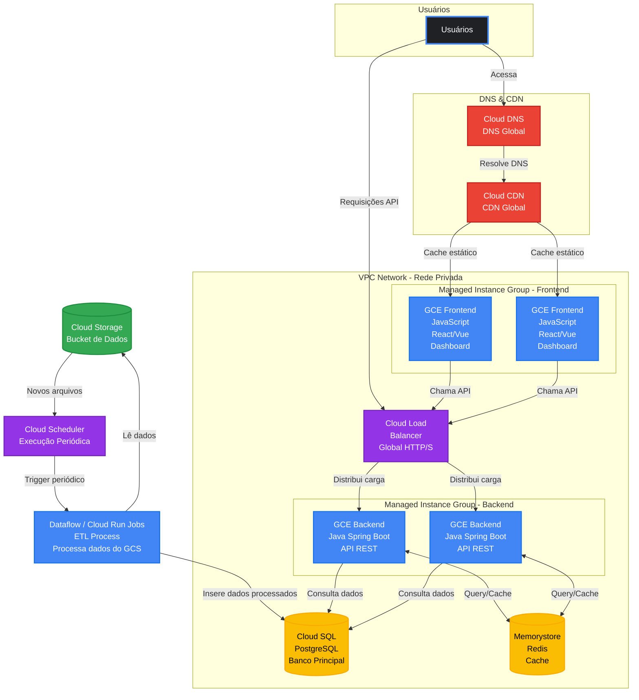

import useBaseUrl from '@docusaurus/useBaseUrl';

## 1 Visão Geral

Esta segunda parte da arquitetura é responsável pela interface de usuário e processamento de requisições dos analistas da Eletromidia. O sistema precisa suportar altos volumes de requisições simultâneas, pois múltiplos usuários estarão acessando dashboards, gerando relatórios e aplicando filtros complexos sobre grandes conjuntos de dados.

## 2 Diagrama da Arquitetura da Aplicação

## 3. Componentes e Justificativas

### 3.1 Cloud DNS

**Função:** Resolver o domínio da aplicação para os endpoints corretos.

O Cloud DNS utiliza uma rede global Anycast, garantindo baixa latência de resolução (tipicamente < 10ms) e alta disponibilidade. A integração nativa com outros serviços do GCP, como o Load Balancer, simplifica o roteamento e a gestão de tráfego.

Também oferece suporte a DNSSEC, aumentando a segurança contra ataques de spoofing.

---

### 3.2 Cloud CDN

**Função:** Distribuir conteúdo estático com baixa latência.

O Cloud CDN entrega arquivos estáticos (HTML, CSS, JS, imagens) a partir de edge locations distribuídas globalmente, utilizando a rede privada do Google.

Isso reduz significativamente o tempo de carregamento e a carga sobre o backend. A solução inclui cache inteligente, compressão automática (Gzip/Brotli) e integração com Cloud Armor para proteção contra DDoS e WAF.

---

### 3.3 Cloud Load Balancer

**Função:** Distribuir requisições entre as instâncias da aplicação.

O Load Balancer global utiliza IP anycast único e roteamento automático para a região mais próxima do usuário, garantindo baixa latência e alta disponibilidade.

Além disso, realiza health checks contínuos, remove instâncias não saudáveis e oferece escalabilidade automática para suportar grandes volumes de requisições.

---

### 3.4 Managed Instance Groups (Backend e Frontend)

**Função:** Gerenciar automaticamente a escalabilidade das instâncias.

Os Managed Instance Groups ajustam dinamicamente o número de instâncias com base na carga, garantindo eficiência de custo e alta disponibilidade.

As instâncias são distribuídas entre múltiplas zonas, com suporte a self-healing e deploys sem downtime (rolling updates). A arquitetura mantém um mínimo de instâncias para resiliência e escala conforme necessário.

---

### 3.5 Backend (GCE - API REST)

**Função:** Processar regras de negócio e expor a API.

O backend é implementado com Spring Boot e segue o modelo stateless, permitindo escalabilidade horizontal e processamento paralelo de requisições.

Essa abordagem facilita o uso de múltiplas instâncias e reduz o acoplamento entre requisições. A arquitetura também permite evolução futura para ambientes containerizados como Cloud Run ou GKE.

---

### 3.6 Frontend (SPA)

**Função:** Interface do dashboard.

A aplicação frontend utiliza React ou Vue para construção de dashboards interativos, com suporte a bibliotecas de visualização de dados.

Como otimização, essa camada pode ser migrada para Cloud Storage + Cloud CDN, eliminando a necessidade de instâncias dedicadas e reduzindo custos operacionais.

---

### 3.7 Cloud SQL (PostgreSQL)

**Função:** Armazenar dados estruturados para consulta.

O Cloud SQL fornece um banco relacional gerenciado com alta disponibilidade, backups automáticos e suporte a read replicas.

A maior parte das operações é de leitura, sendo possível distribuir carga e otimizar consultas através de índices e tuning adequado.

---

### 3.8 Memorystore (Redis)

**Função:** Reduzir latência e carga no banco.

O Redis atua como cache distribuído em memória, armazenando resultados de queries frequentes e dados agregados.

A estratégia adotada é **cache-aside**, permitindo que a aplicação consulte o cache antes do banco. Isso reduz significativamente o tempo de resposta e o consumo de recursos do Cloud SQL.

---

### 3.9 Dataflow / Cloud Run Jobs (Worker ETL)

**Função:** Processar e transformar dados do Data Lake.

O ETL é executado de forma desacoplada, lendo dados do Cloud Storage e atualizando o banco relacional.

Para workloads mais complexos, recomenda-se Dataflow (Apache Beam). Para cenários mais simples, Cloud Run Jobs oferece uma alternativa mais leve e eficiente.

O processamento deve ser idempotente para evitar inconsistências em reprocessamentos.

---

### 3.10 Cloud Scheduler

**Função:** Orquestrar execuções periódicas.

O Cloud Scheduler permite agendar execuções do pipeline ETL utilizando cron expressions, com suporte a retry automático em caso de falhas.

---

## 4. Fluxo de Requisições

### 4.1 Acesso ao Frontend

O usuário acessa a aplicação via domínio configurado no Cloud DNS, que direciona para o Cloud CDN/Load Balancer.

O CDN verifica o cache:
- **Cache hit:** resposta em baixa latência (~5–30ms)
- **Cache miss:** busca no origin, armazena e retorna (~100–300ms)

---
### 4.2 Requisições à API

O frontend realiza chamadas HTTP para a API, que são recebidas pelo Cloud Load Balancer e distribuídas entre as instâncias backend disponíveis.

O fluxo de processamento segue o padrão:

- O backend verifica o cache (Memorystore)
- Em caso de **cache hit**, a resposta é retornada imediatamente (< 1ms)
- Em caso de **cache miss**, consulta o Cloud SQL
- O resultado é armazenado no cache
- A resposta é retornada ao cliente

Esse padrão reduz drasticamente a latência média e evita sobrecarga no banco de dados.

---

### 4.3 Processamento ETL (Background)

O pipeline de dados opera de forma assíncrona:

- O Cloud Scheduler dispara execuções periódicas
- O job (Dataflow ou Cloud Run) lê dados do Data Lake
- Aplica transformações, validações e agregações
- Persiste os dados no Cloud SQL

Esse fluxo garante atualização contínua dos dados sem impactar a experiência do usuário.

---

## 5. Estratégias de Escalabilidade

A arquitetura foi projetada para suportar alta volumetria através de:

- **Escalabilidade horizontal:** Managed Instance Groups ajustam automaticamente o número de instâncias  
- **Cache em múltiplas camadas:** Cloud CDN (edge) + Redis (dados dinâmicos)  
- **Load balancing global:** distribuição eficiente via IP anycast  
- **Arquitetura stateless:** facilita replicação e paralelismo  
- **Serviços gerenciados:** garantem alta disponibilidade e resiliência  

Essa combinação permite absorver picos de carga mantendo baixa latência.

---

## 6. Estimativa de Capacidade

**Cenário:** 1.000 usuários simultâneos (≈ 10 req/s por usuário)

| Camada | Capacidade | Custo Mensal |
|--------|-----------|-------------|
| Cloud DNS | Ilimitado | US$ 0,20 |
| Cloud CDN | 10TB transferência | US$ 800 |
| Load Balancer | Milhões req/s | US$ 50 |
| Backend (4x e2-medium) | ~1.600 req/s | US$ 97 |
| Frontend (2x e2-small) | ~2.000 req/s | US$ 24 |
| Cloud SQL | HA regional | US$ 187 |
| Redis (Memorystore) | ~100.000 ops/s | US$ 353 |
| ETL + Scheduler | Execuções periódicas | US$ 50 |
| **Total** | | **~US$ 1.561/mês** |

---

## 7. Considerações

A arquitetura prioriza simplicidade operacional, escalabilidade e baixa latência.

O uso de cache em múltiplas camadas, combinado com uma arquitetura stateless e serviços gerenciados, permite suportar grandes volumes de acesso com eficiência.

Como evolução futura, é possível:

- Migrar o frontend para Cloud Storage + CDN (serverless)
- Substituir GCE por Cloud Run ou GKE para maior flexibilidade
- Utilizar AlloyDB em cenários de alta demanda analítica
- Implementar estratégias mais avançadas de cache e particionamento

Essas evoluções permitem reduzir custos e aumentar a performance conforme o sistema cresce.