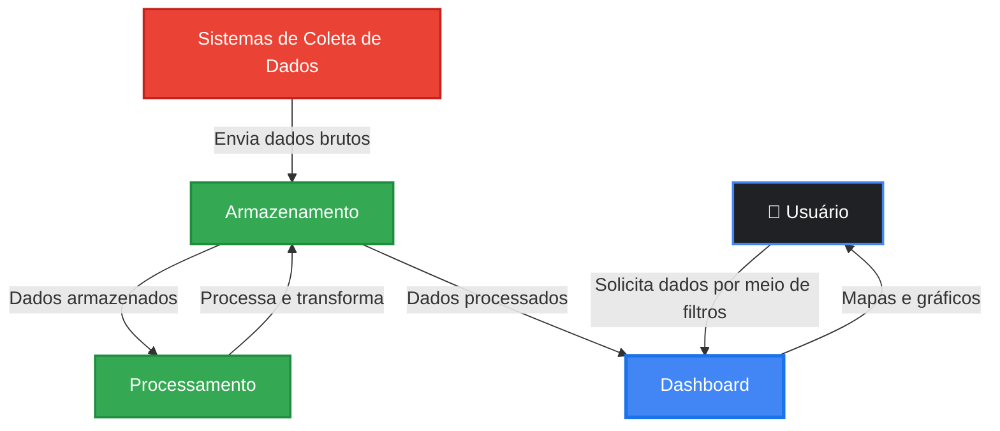

import useBaseUrl from '@docusaurus/useBaseUrl';

# Arquitetura da Aplicação - Versão GCP

:::info
Esta é a versão 2 da arquitetura da aplicação, migrada para Google Cloud Platform (GCP). Esta versão representa uma evolução da arquitetura original AWS, mantendo os mesmos princípios de escalabilidade e alta disponibilidade, com otimizações específicas do ecossistema Google Cloud.
:::

## 1. Visão Geral do Sistema

O projeto consiste no desenvolvimento de uma aplicação web para análise de dados de mídia exterior (OOH - Out of Home) para a Eletromidia. No contexto real, a empresa recebe um arquivo CSV a cada 3 meses contendo dados consolidados. No entanto, para este projeto acadêmico, estamos simulando um cenário de API em tempo real que envia requisições HTTP com lotes de dados várias vezes por segundo/minuto, permitindo o estudo e desenvolvimento de uma aplicação intensiva de dados com alta volumetria.

A arquitetura foi dividida em dois momentos principais:

1. Ingestão de Dados e Armazenamento (Data Lake e Data Warehouse)
2. Utilização da Aplicação (Frontend/Backend - Dashboard)

Esta divisão permite uma separação clara de responsabilidades, escalabilidade independente de cada componente e otimização específica para diferentes tipos de carga de trabalho.

---

## 2. Migração de AWS para GCP

:::tip Por que migrar para GCP?
A decisão de migrar para Google Cloud Platform foi baseada na atual stack tecnológica do parceiro de projeto, Eletromídia. Dessa forma, a fins de aprendizado e compatibilidade com o parceiro, alteramos a arquitetura para sua segunda versão, utilizando o ambiente Google Cloud Platform. Esta seção documenta as principais motivações e trade-offs envolvidos.
:::
