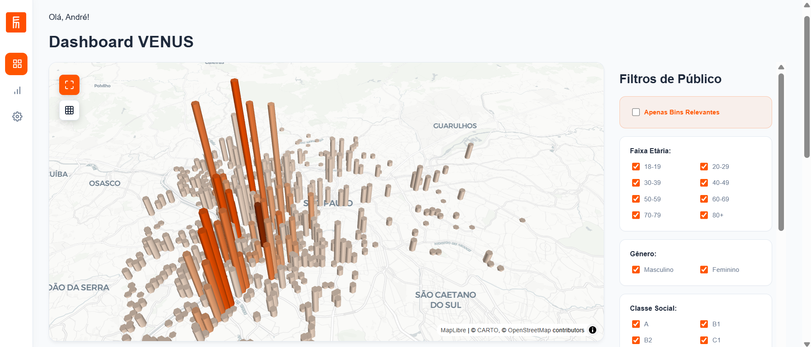
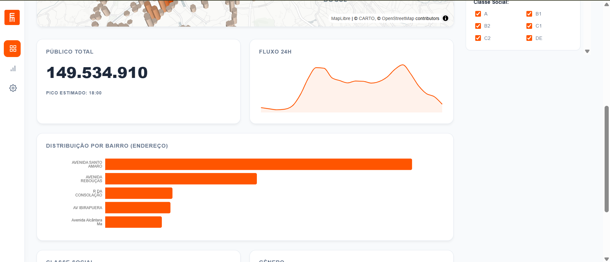
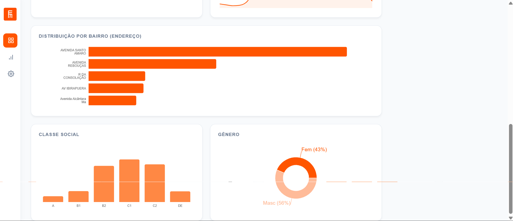

import useBaseUrl from '@docusaurus/useBaseUrl';

## 1. Frontend - Dashboard

&emsp;O frontend do projeto consiste em uma aplicação web interativa desenvolvida com React e Vite, cujo objetivo central é consolidar um volume massivo de dados geoespaciais e exibir o fluxo diário de pessoas na cidade de São Paulo através, principalmente, de um mapa 3D intuitivo. Esta aplicação foi desenhada para ser performática e amigável, permitindo que usuários gerem insights rápidos através de filtros demográficos e processamento em tempo real, facilitando a visualização de dados de mobilidade que, em formato bruto, seriam de difícil interpretação.

&emsp;A base para a visualização inicial é um conjunto de dados estático que contém registros geolocalizados de fluxo de pessoas que recebemos da claro. Os dados estruturais lidos pela aplicação incluem um identificador de local, o horário da leitura do fluxo, a quantidade absoluta de pessoas únicas (volumetria), as coordenadas espaciais de latitude e longitude e um objeto detalhando a proporção demográfica dessas pessoas por idade, gênero e classe social. É a partir dessas informações estruturadas que o frontend constrói a representação visual dos fluxos urbanos.

&emsp;Para solucionar o desafio de renderizar milhões de pontos sem comprometer o desempenho da interface, a aplicação emprega a biblioteca deck.gl integrada ao ecossistema React, optando por uma abordagem visual baseada em um Mapa de Calor Hexagonal 3D através da HexagonLayer. Os pontos geográficos carregados recebem valores ponderados e são agrupados em células hexagonais com um raio definido de 200 metros. Nesse processo, ocorre uma agregação por soma, o que significa que se diversos pontos de coleta estiverem localizados no mesmo polígono hexagonal, o fluxo de pessoas de todos eles será somado. O resultado dessa agregação dita tanto a elevação, ou seja, a altura no espaço 3D, quanto a coloração do hexágono, criando instantaneamente "picos de calor" nas zonas onde se observa uma maior concentração de pessoas. O usuário pode interagir com o mapa utilizando os comandos de navegação (Pan, Zoom e Tilt através de Ctrl + Drag) para explorar os dados sob diferentes perspectivas e visualizar em um tooltip a contagem exata de pessoas ao passar o mouse sobre cada barra hexagonal.

&emsp;Uma das principais funcionalidades do frontend é a capacidade de realizar o cruzamento demográfico interativo diretamente no painel lateral (sidebar). Ao invés de apenas plotar os dados brutos, a ferramenta permite que o usuário refine o público exibido combinando categorias demográficas. 

&emsp;O sistema responde em tempo real calculando a interseção das taxas agregadas de dimensões como idade, gênero e classe social, multiplicando a volumetria absoluta por um fator probabilístico gerado a partir dessa seleção. Assim, o mapa é atualizado dinamicamente para refletir o calor e a elevação correspondentes exclusivamente ao público-alvo filtrado, oferecendo uma ferramenta de altíssimo valor estratégico para análise de mercado e direcionamento de campanhas.

---

## 2. Tela Principal da Aplicação - Dashboard

&emsp;A tela principal, denominada **Dashboard VENUS**, centraliza a visualização geoespacial interativa. Nela, o mapa 3D exibe a densidade populacional representada por colunas hexagonais sobre a região metropolitana de São Paulo. A altura e o tom de cor de cada coluna indicam a intensidade do fluxo no local. À direita, encontra-se o painel de **Filtros de Público**, onde o usuário pode refinar a análise ativando ou desativando categorias específicas de **Faixa Etária**, **Gênero** e **Classe Social**, além de poder alternar a visualização para exibir "Apenas Bins Relevantes".

## 3. Painel de Visualização Demográfica e Métricas

&emsp;Além do mapa 3D central, a aplicação conta com um painel analítico secundário, focado em oferecer métricas consolidadas de forma rápida e visual. Este painel permite que os usuários compreendam o contexto geral do público-alvo filtrado através de indicadores e gráficos complementares.

&emsp;O indicador de **Público Total** apresenta a volumetria absoluta de pessoas únicas estimadas com base nos filtros aplicados no momento, destacando adicionalmente o horário estimado de pico desse fluxo. O gráfico de **Fluxo 24h**, em formato de linha do tempo, detalha como essa volumetria se distribui ao longo das horas do dia, evidenciando os períodos de maior e menor movimento para facilitar o entendimento da jornada diária da audiência.

&emsp;Outro componente essencial é o gráfico de **Distribuição por Bairro (Endereço)**. Em formato de barras horizontais, ele lista de maneira ordenada as vias e endereços que apresentam a maior concentração do público selecionado. Essa visualização tabular e em ranking complementa perfeitamente a visão geoespacial fornecida pelo mapa, permitindo que estrategistas identifiquem rapidamente os locais de maior valor agregado. Assim como o mapa, todos estes gráficos respondem em tempo real às interações nos filtros de demografia, proporcionando uma experiência de análise integrada.

&emsp;Para um aprofundamento ainda maior na composição do público, o painel também inclui gráficos focados na **Distribuição por Gênero** e **Distribuição por Classe Social**. Essas visualizações detalham a representatividade proporcional de cada subgrupo dentro da volumetria total filtrada. Dessa forma, é possível entender rapidamente qual a fatia de homens e mulheres impactados, assim como a divisão do público entre as classes sociais (A, B1, B2, C1, C2 e DE), oferecendo recursos para o planejamento de campanhas segmentadas.

---

## 4. Como Executar o Projeto Localmente

&emsp;Para rodar a aplicação frontend em sua máquina local, certifique-se de ter o Node.js instalado e siga os passos abaixo:
:::info
**1**. Instale as dependências do projeto através do comando `npm install` no diretório raiz do frontend (`sp-density-map`).

**2**. Inicie o servidor de desenvolvimento executando o comando `npm run dev`.

**3**. Abra o seu navegador na URL fornecida no terminal, que geralmente será `http://localhost:5173`. A partir desse ponto, o mapa 3D interativo será renderizado e estará pronto para navegação e filtragem.
:::