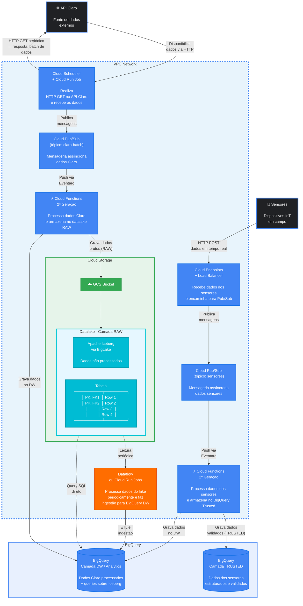
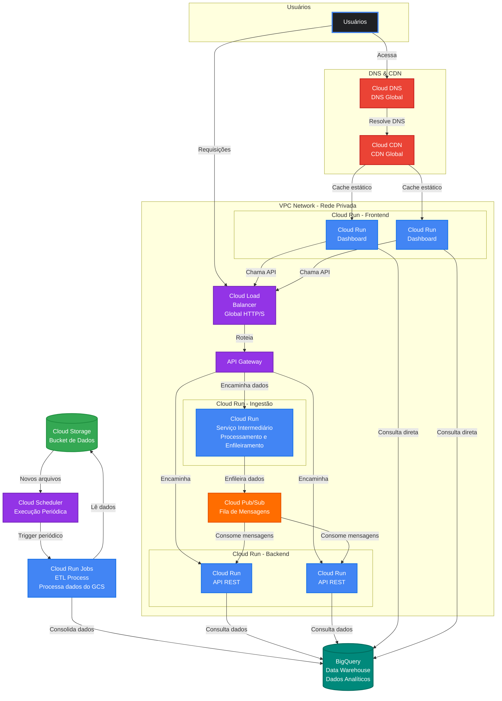

Ao longo do desenvolvimento do projeto, algumas alterações precisaram ser feitas na arquitetura para melhor atender aos requisitos do projeto. Desse modo, a principal alteração da arquitetura da primeira Sprint de desenvolvimento em relação à segunda Sprint foi a migração do provedor de nuvem utilizado: ao invés de utilizarmos a AWS, passamos a utilizar a Google Cloud Platform (GCP). Tal alteração se deu por alguns motivos. O primeiro deles é que a Eletromídia já utiliza os serviços da Google, o que agrega mais valor ao projeto por facilitar a integração com o sistema já existente. Ademais, outro ponto que influenciou essa decisão foi a disponibilidade de créditos na GCP, pois, ao criar uma conta, a plataforma libera trezentos dólares para desenvolvimento. Com a AWS, possuíamos cinquenta dólares provenientes do acesso de estudante, contudo haveria a derrubada constante dos serviços. Dessa forma, optamos pela GCP.

## Escolha dos serviços

A decisão de utilizar uma fila de mensagens em vez do Kafka se deve ao fato de que o projeto não requer streaming de dados nem processamento em tempo real. Uma fila simples atende satisfatoriamente ao volume e ao padrão de consumo esperados, sendo mais leve e de mais fácil manutenção para o caso de uso em questão. Em relação ao serviço de computação, optamos pelo Cloud Run em detrimento do App Engine e do Google Kubernetes Engine (GKE); dado que o Cloud Run oferece escalabilidade automática com cobrança por uso, sem a necessidade de gerenciar infraestrutura subjacente, o que o torna mais adequado do que o GKE, que exige configuração e manutenção de clusters. Em comparação ao App Engine, o Cloud Run oferece maior flexibilidade na conteinerização e no controle do ambiente de execução.

## Evolução da segunda para a terceira Sprint

Da segunda para a terceira Sprint, alguns serviços precisaram ser adicionados. Foi introduzido um novo serviço Cloud Run posicionado entre o API Gateway e a fila de mensagens, cuja responsabilidade é processar e encaminhar os dados recebidos para a fila. A adição desse serviço intermediário se justifica pela necessidade de desacoplar a camada de entrada de dados da camada de enfileiramento, permitindo que transformações, validações e enriquecimentos dos dados sejam realizados de forma isolada antes de sua inserção na fila. Além disso, a dashboard passou a consultar diretamente o BigQuery para obtenção dos dados analíticos; tal escolha se justifica pelo fato de o BigQuery ser um serviço de data warehouse otimizado para consultas sobre grandes volumes de dados, oferecendo alto desempenho e escalabilidade nativa para esse tipo de workload. A integração direta elimina camadas intermediárias desnecessárias entre a visualização e os dados consolidados, reduzindo a latência das consultas e simplificando a arquitetura. Por ser um serviço gerenciado pela GCP, o BigQuery também se integra naturalmente aos demais componentes da infraestrutura adotada, garantindo consistência operacional.

Vale destacar que, conforme descrito na arquitetura da segunda Sprint, toda a arquitetura foi projetada para suportar um alto volume de carga, garantindo que as adições realizadas na terceira Sprint se integrem de forma consistente com os requisitos de escalabilidade já estabelecidos. 

## Diagramas de Arquitetura

Conforme explicado nas sprints anteriores, a arquitetura foi dividida em duas parte a fim de facilitar a organização do desenvolvimento e separar claramente as responsabilidades de cada parte. As duas partes são:

* Ingestão de Dados e Armazenamento
* tilização da Aplicação (Frontend/Backend - Dashboard)

### 1.2 Diagrama da Arquitetura de Ingestão de Dados e Armazenamento

Este diagrama representa o fluxo de ingestão, processamento e armazenamento dos dados provenientes de duas fontes externas distintas: a **API da Claro** (dados em lote) e os **Sensores IoT** (dados em tempo real). Toda a infraestrutura está contida dentro de uma **VPC Network** na GCP, garantindo isolamento e segurança de rede.

#### Fluxo de dados dos Sensores IoT (tempo real)

1. Os sensores enviam dados via HTTP POST para um Cloud Endpoints + Load Balancer, que atua como ponto de entrada seguro e escalável.
2. As mensagens são publicadas no tópico Cloud Pub/Sub `sensores`.
3. Uma Cloud Function dedicada é acionada via Eventarc, processando e validando os dados dos sensores.
4. Os dados validados são gravados na camada TRUSTED do BigQuery**, além de também alimentarem a camada Analytics para consolidação.

#### Camadas de armazenamento

| Camada | Tecnologia | Finalidade |
|---|---|---|
| RAW | GCS + Apache Iceberg (BigLake) | Armazenamento bruto, imutável e auditável |
| TRUSTED | BigQuery | Dados de sensores validados e estruturados |
| Analytics | BigQuery | Dados consolidados e prontos para análise |

### 2.2 Diagrama da Arquitetura da Aplicação

Este diagrama representa a arquitetura voltada à utilização da plataforma pelos usuários, abrangendo o fluxo de acesso ao frontend (Dashboard), o acesso aod dados no BigQuery e o processo de ETL que alimenta o Data Warehouse.

#### Fluxo de acesso do usuário ao frontend

1. O usuário acessa a aplicação via Cloud DNS, que resolve o domínio e redireciona para o Cloud CDN.
2. O CDN entrega os assets estáticos com cache, reduzindo latência e carga nos servidores.
3. As instâncias de Cloud Run (Dashboard) servem a interface da aplicação e realizam consulta direta ao BigQuery para obtenção dos dados analíticos, eliminando camadas intermediárias desnecessárias.

#### Fluxo de ETL

1. Novos arquivos gravados no Cloud Storage acionam o Cloud Scheduler.
2. O Scheduler dispara periodicamente um job de Cloud Run (ETL Process), que lê os dados do GCS, consolida e carrega no BigQuery Data Warehouse.
3. A dashoboar consulta o BigQuery para servir dados atualizados ao frontend.

