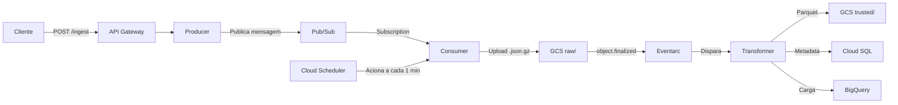

# Infraestrutura de Ingestao de Dados

## Visao Geral

A infraestrutura de ingestão de dados compõe uma pipeline *event-driven* composta por três microsserviços independentes, Producer, Consumer e Transformer, que processam os dados em etapas. A arquitetura da pipeline de ingestão conta, ainda, com uma divisão em três camadas: raw, trusted e analytics, num padrão Data Lakehouse em formato Apache Iceberg. Após processamento, salvam-se os dados em BigQuery, para uso em consultas SQL e analíticas. Abaixo, explora-se em detalhes o funcionamento da pipeline ingestão.

### Fluxo Completo

O diagrama abaixo ilustra o fluxo de ponta a ponta, desde a requisição do cliente até o armazenamento final:



Existem dois modelos de execução distintos na pipeline. O Consumer opera por polling: é um job batch disparado pelo Cloud Scheduler a cada 1 minuto, que puxa mensagens acumuladas no Pub/Sub. Já o Transformer opera de forma event-driven: é acionado automaticamente pelo Eventarc sempre que um arquivo é criado no GCS (`object.finalized`), sem necessidade de polling. Essa distinção é intencional — o Consumer agrupa mensagens em lotes para otimizar escrita, enquanto o Transformer reage imediatamente a cada lote disponível.

### Camadas do Data Lakehouse

| Camada | Local | Formato |
|---|---|---|
| Raw | `gs://venus-datalake/raw/` | JSON comprimido (`.json.gz`) |
| Trusted | `gs://venus-datalake/trusted/` | Parquet (Iceberg) |
| Analytics | BigQuery `trusted.ingestao` | Tabela nativa |

Como mencionado, o Data Lakehouse é dividido em três camadas: raw, trusted e analytics. A camada raw armazena os dados brutos, exatamente como recebidos. A camada trusted armazena os dados deduplicados, validados (source of truth). A camada analytics armazena os dados consolidados, prontos para uso em consultas SQL e analíticas.

### Componentes em Detalhe

#### 1. Producer (Cloud Run Service)

Arquivo: `src/infra_ingestao/producer/main.go`

O Producer é o ponto de entrada da pipeline. Requisições externas passam primeiro por um API Gateway (`ingestao-gateway`), que roteia o tráfego para o Producer. O Producer, por sua vez, recebe as requisições HTTP e publica as mensagens no Pub/Sub.

Endpoints:

| Metodo | Path | Descricao |
|---|---|---|
| `POST` | `/ingest` | Recebe dados e publica no Pub/Sub |
| `GET` | `/health` | Health check |

Schema de entrada (JSON):

```json
{
  "latitude": -23.5505,
  "longitude": -46.6333,
  "idade": 30,
  "classe_social": "B",
  "genero": "F"
}
```

Lógica:
1. Valida que o método é `POST`
2. Le e valida o body da requisição
3. Publica a mensagem de forma síncrona no Pub/Sub
4. Retorna `202 Accepted` com o `message_id`

---

#### 2. Consumer (Cloud Run Job)

Arquivo: `src/infra_ingestao/consumer/main.go`

Diferente do Transformer, o Consumer não é event-driven — é um job batch acionado por um Cloud Scheduler a cada 1 minuto. Ele puxa mensagens acumuladas no Pub/Sub, comprime em lote e salva no GCS na camada raw, particionando por data. Esse modelo de polling permite agrupar múltiplas mensagens em um único arquivo, reduzindo a quantidade de arquivos no GCS e otimizando o processamento downstream.

Lógica:
1. Conecta ao Pub/Sub subscription
2. Configura pull com `BATCH_SIZE` mensagens e timeout de 30 segundos
3. Valida cada mensagem como JSON válido (ACK mensagens invalidas para evitar replay)
4. Se nenhuma mensagem: encerra sem escrever
5. Serializa todas as mensagens como JSON array
6. Comprime com gzip
7. Faz upload para `raw/YYYY/MM/DD/batch-{unix_timestamp}.json.gz`

Particionamento no GCS:
```
raw/
  2026/
    03/
      15/
        batch-1710504000.json.gz
        batch-1710504060.json.gz
        ...
```

---

#### 3. Transformer (Cloud Run Service)

Arquivo: `src/infra_ingestao/transformer/main.py`

O Transformer é o componente de ETL que transforma dados brutos em dados confiáveis. É acionado automaticamente pelo Eventarc, que dispara uma requisição ao Transformer sempre que um novo arquivo é criado no GCS (evento `google.cloud.storage.object.v1.finalized` na pasta `raw/`). Dessa forma, cada lote gerado pelo Consumer é processado segundos após sua criação, sem necessidade de polling.

O Transformer escreve os dados em dois destinos: Apache Iceberg e BigQuery. Essa estratégia de dual-write é intencional — o Iceberg funciona como *source of truth*, oferecendo dados imutáveis, versionados e com suporte a time-travel. O BigQuery funciona como camada de consulta rápida, otimizada para queries SQL e ferramentas de BI. Não se trata de redundância: cada destino tem um propósito distinto.

Schema Iceberg (Source of Truth):

| Campo | Tipo | Obrigatorio | Particao |
|---|---|---|---|
| `latitude` | DOUBLE | Nao | - |
| `longitude` | DOUBLE | Nao | - |
| `idade` | INTEGER | Nao | - |
| `classe_social` | STRING | Nao | - |
| `genero` | STRING | Nao | - |
| `ingested_at` | TIMESTAMP (us) | Sim | DayTransform |
| `source_file` | STRING | Sim | - |

Schema BigQuery:

| Campo | Tipo | Modo | Particao |
|---|---|---|---|
| `latitude` | FLOAT | NULLABLE | - |
| `longitude` | FLOAT | NULLABLE | - |
| `idade` | INTEGER | NULLABLE | - |
| `classe_social` | STRING | NULLABLE | - |
| `genero` | STRING | NULLABLE | - |
| `ingested_at` | TIMESTAMP | NULLABLE | DAY |
| `source_file` | STRING | NULLABLE | - |
| `ingested_day` | DATE | NULLABLE | - |

Processo de deduplicação:

O Transformer remove duplicatas exatas comparando o conteúdo completo de cada registro via hash canônico do JSON. Registros identicos são descartados e a contagem é logada.

---

### Resiliência da Pipeline

A pipeline foi projetada para lidar com falhas em diferentes pontos sem perda de dados:

- Mensagens inválidas no Consumer: mensagens que não são JSON válido recebem ACK imediatamente, evitando que fiquem em loop infinito de retry (poison messages).
- Idempotência do Transformer: como o Transformer deduplica por conteúdo, reprocessar o mesmo arquivo não gera dados duplicados na camada trusted. Isso permite retries seguros.
- Ordem de escrita: o Iceberg é sempre escrito primeiro. Se a carga no BigQuery falhar, os dados já estão seguros no Iceberg (source of truth). O BigQuery pode ser recarregado a partir do Iceberg a qualquer momento.
- Sem mensagens no Consumer: se não há mensagens no Pub/Sub, o Consumer encerra sem escrever nenhum arquivo, evitando lotes vazios.

---

### Service Accounts e IAM

Cada componente tem uma service account dedicada seguindo o principio de menor privilégio:

| Service Account | Roles | Justificativa |
|---|---|---|
| `cloud-run-producer` | `pubsub.publisher` | Publica mensagens no tópico |
| `cloud-run-consumer` | `pubsub.subscriber`, `storage.objectCreator`, `run.invoker` | Lê mensagens, escreve no GCS, auto-invocacao via Scheduler |
| `cloud-run-transformer` | `storage.objectViewer`, `storage.objectCreator`, `eventarc.eventReceiver`, `run.invoker`, `cloudsql.client`, `bigquery.dataEditor`, `bigquery.jobUser` | Le raw, escreve trusted, recebe eventos, conecta ao PostgreSQL, escreve no BigQuery |

---

## Catálogo Iceberg (Cloud SQL PostgreSQL)

O Apache Iceberg usa um catálogo PostgreSQL hospedado no Cloud SQL para armazenar metadata das tabelas (localizacao dos arquivos Parquet, snapshots, schemas, etc). O Transformer usa uma classe customizada `CloudSqlCatalog` que herda de `SqlCatalog` do PyIceberg, adaptando-a para aceitar uma engine SQLAlchemy externa (necessaria para o Cloud SQL Connector).

---

## Como Testar

### Enviando dados

```bash
curl -X POST https://<API_GATEWAY_URL>/ingest \
  -H "Content-Type: application/json" \
  -d '{
    "latitude": -23.5505,
    "longitude": -46.6333,
    "idade": 30,
    "classe_social": "B",
    "genero": "F"
  }'
```

### Executando o Consumer manualmente

```bash
gcloud run jobs execute consumer \
  --region=southamerica-east1 \
  --project=venus-m09
```

### Consultando dados no BigQuery

```sql
SELECT *
FROM `venus-m09.trusted.ingestao`
WHERE DATE(ingested_at) = CURRENT_DATE()
ORDER BY ingested_at DESC
LIMIT 10;
```

### Verificando logs

```bash
# Producer
gcloud logging read "resource.type=cloud_run_revision AND resource.labels.service_name=producer" --limit=10

# Consumer
gcloud logging read "resource.type=cloud_run_job AND resource.labels.job_name=consumer" --limit=10

# Transformer
gcloud logging read "resource.type=cloud_run_revision AND resource.labels.service_name=transformer" --limit=10
```
